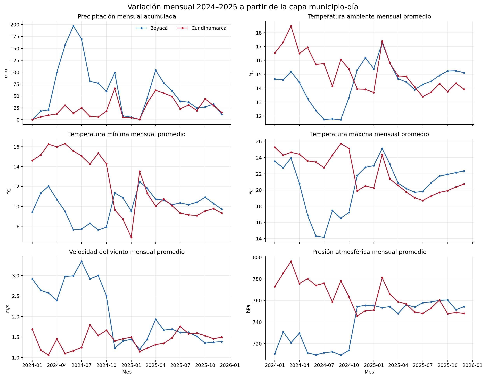
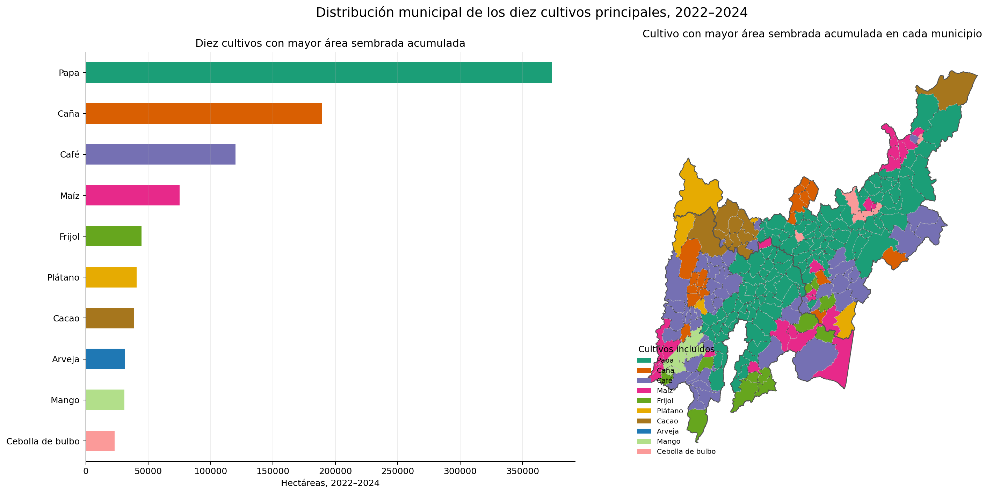
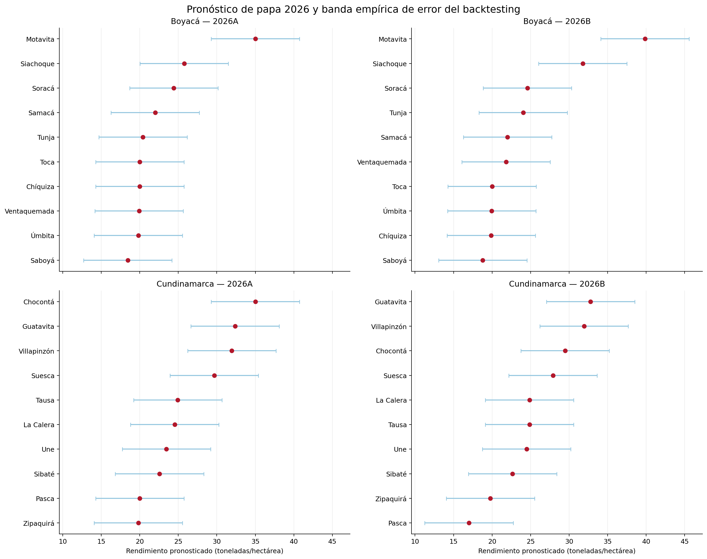
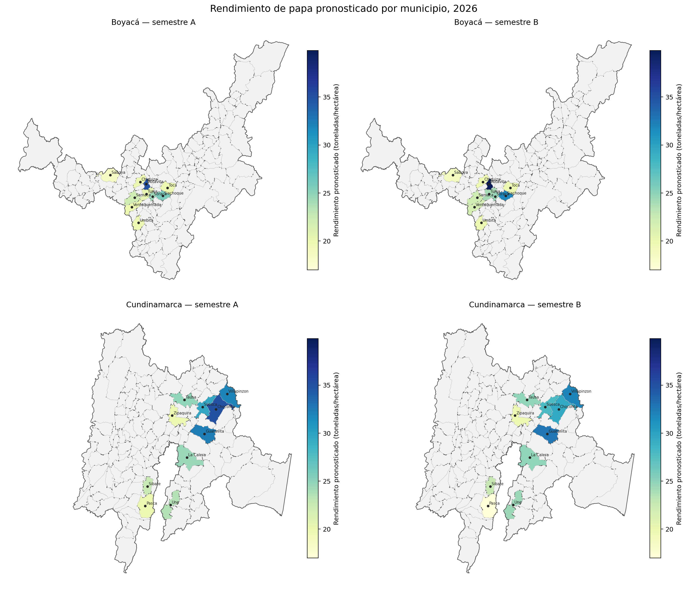

# rAIz

rAIz implementa procesos auditables para analizar datos climáticos, agrícolas y
geográficos, y pronosticar el rendimiento de cultivos. La primera versión se
concentra en papa, en los diez municipios con mayor área sembrada de Boyacá y
los diez de Cundinamarca, para los semestres A y B de 2026.

## Estado del proyecto

El flujo vigente cubre:

- descarga, auditoría, limpieza y homogeneización de seis variables de
  estaciones del Instituto de Hidrología, Meteorología y Estudios Ambientales
  (IDEAM);
- consolidación del clima desde observaciones subdiarias hasta
  municipio × día;
- agregación de las Evaluaciones Agropecuarias Municipales (EVA) a
  municipio × cultivo × período;
- validación geográfica mediante códigos DANE y polígonos municipales;
- construcción de un conjunto de datos de pronóstico con historia agrícola
  2019–2025, clima diario, geografía y períodos objetivo de 2026;
- comparación temporal de métodos y generación de 40 pronósticos de
  rendimiento de papa.

La capa climática de estaciones cubre 2024–2025 para precipitación, temperatura
ambiente, temperatura mínima, temperatura máxima, velocidad del viento y presión
atmosférica. Para entrenar el pronóstico se usa NASA POWER 2019–2026, porque
ofrece una cobertura histórica homogénea en todos los municipios. La humedad de
estaciones permanece bloqueada hasta aprobar un contrato de procesamiento.

## Resultados del análisis de información

El proceso conserva la frecuencia real de cada fuente. El clima se mantiene a
nivel diario y se resume por semestre únicamente al cruzarlo con EVA; los
registros agrícolas anuales o semestrales no se convierten en observaciones
diarias artificiales.

| Producto | Resultado |
|---|---:|
| Agregado agrícola | 13.692 filas municipio × cultivo × período |
| Comparaciones agrícolas interanuales | 9.377 |
| Municipios enlazados con geometría | 239 |
| Conjunto de datos de pronóstico | 2.366 filas y 56 columnas |
| Indicadores climáticos candidatos | 33 |
| Municipios objetivo | 20 |
| Pronósticos para 2026 | 40 |

La auditoría también detectó limitaciones que se conservan como evidencia:
una brecha común de observaciones entre el 5 y el 25 de febrero de 2025,
municipios sin estación utilizable, nueve estaciones con asignación geográfica
pendiente y una cobertura municipal de precipitación que aún requiere revisión
científica.

El proceso completo, las reglas por variable y las gráficas de clima, cultivos y
geografía se explican en el
[resumen de resultados 2026](docs/presentation/RESULTADOS_PROCESO_DATOS_2026.md).

## Resultado del pronóstico

Se compararon referencias temporales, regresión lineal regularizada, bosques de
árboles, árboles extra, potenciación por gradiente y una red neuronal multicapa.
El modelo final usa el último rendimiento conocido del mismo municipio y
semestre. Aunque es una referencia simple, obtuvo el menor error absoluto medio en la
validación reciente y evitó sobreajustar una serie de solo siete años por
municipio y semestre.

| Evaluación del modelo final | Resultado |
|---|---:|
| Error absoluto medio 2024–2025 | 2,302 t/ha |
| Raíz del error cuadrático medio 2024–2025 | 3,965 t/ha |
| Coeficiente de determinación 2024–2025 | 0,276 |
| Error porcentual absoluto simétrico 2024–2025 | 9,50 % |
| Error absoluto medio global 2021–2025 | 2,422 t/ha |

El **error absoluto medio** expresa cuántas toneladas por hectárea se desvía el
pronóstico en promedio. La **raíz del error cuadrático medio** penaliza con más
fuerza los errores grandes. El **coeficiente de determinación** indica la
proporción de variación explicada, y el **error porcentual absoluto simétrico**
presenta el error relativo de forma balanceada.

### Rendimiento medio pronosticado para 2026

| Departamento | Semestre | Municipios | Rendimiento medio (t/ha) |
|---|---|---:|---:|
| Boyacá | A | 10 | 22,58 |
| Boyacá | B | 10 | 24,27 |
| Cundinamarca | A | 10 | 26,43 |
| Cundinamarca | B | 10 | 25,58 |

Estos valores son pronósticos, no resultados observados. El semestre 2026-A
incorpora 181 días climáticos reales; 2026-B incorpora 27 días reales y 157 días
de climatología 2019–2025 con corte al 30 de julio de 2026. El segmento más
débil en la validación fue Cundinamarca-B, con un error absoluto medio de
3,261 t/ha. La precisión definitiva solo podrá medirse cuando UPRA publique las
EVA de 2026.

## Documentación

- [Mapa de documentación](docs/README.md)
- [Estado vigente y alcance](docs/project_status.md)
- [Ciclo consolidado de datos](docs/data_pipeline/README.md)
- [Resultados, gráficas y mapas](docs/presentation/RESULTADOS_PROCESO_DATOS_2026.md)
- [Flujo de pronóstico](notebooks/CropForecasting/README.md)
- [Evaluación y resultados detallados](notebooks/CropForecasting/RESULTS.md)
- [Guía de colaboración](CONTRIBUTING.md)

Los notebooks y artefactos predictivos están separados en
[`notebooks/CropForecasting`](notebooks/CropForecasting/). La exploración de
suelos permanece fuera del alcance analítico de esta versión y no se presenta
como una variable del modelo.

## Fuentes principales

- Evaluaciones Agropecuarias Municipales de la Unidad de Planificación Rural
  Agropecuaria (UPRA).
- Datos abiertos de estaciones del IDEAM.
- Datos meteorológicos diarios de NASA POWER.
- División Político-Administrativa de Colombia (DIVIPOLA) y geometrías
  municipales.
