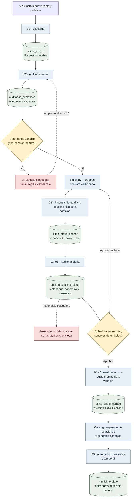

# Guia operativa del pipeline climatico

**Actualizado:** 22 de julio de 2026  
**Estado:** vigente  
**Objetivo operativo actual:** producir datos climaticos diarios curados de
Boyaca y Cundinamarca para 2024 y 2025

Este documento es la entrada tecnica para integrantes y asistentes de IA que
trabajen en el pipeline. No se debe habilitar una variable nueva copiando reglas
de otra ni interpretar una celda ejecutada como prueba suficiente de calidad.

## Por que existen dos auditorias

Los datos cambian de significado al pasar de observaciones subdiarias a valores
diarios. Por eso se audita antes y despues de transformar:

La auditoria 02 responde si la fuente puede transformarse y como debe hacerse.
La auditoria 03_01 responde si la transformacion produjo una serie diaria
defendible. Ninguna reemplaza a la otra. Las flechas de retorno son
deliberadas: un hallazgo puede exigir modificar el contrato y repetir el piloto
antes de consolidar o escalar.

## Responsabilidad y compuerta de cada paso

### 01. Descargar sin reinterpretar

**Entrada:** API Socrata filtrada por variable, departamento, ano y mes.  
**Salida:** `clima_crudo/.../part-*.parquet`.  
**Garantia:** conserva los valores de la fuente y permite reanudar lotes.  
**No garantiza:** calidad, continuidad ni semantica correcta del sensor.

Compuerta antes de 02:

- Rutas canonicas y fuente correcta.
- Partes consecutivas y ultimo lote menor de 1.000 cuando corresponda.
- Manifiesto o resumen de tiempo, filas y bytes.
- Los crudos nunca se corrigen ni se sobrescriben para limpiar datos.

### 02. Auditar la fuente cruda

**Entrada:** Parquet crudos.  
**Salida:** inventarios, tablas diagnosticas y Markdown en
`auditorias_climaticas`.  
**Proposito:** descubrir el contrato que necesita la variable.

La auditoria revisa:

- Presencia y tipos de las 13 columnas esperadas por archivo.
- Filas, partes, meses y fechas internas de las particiones.
- Unidades, conversiones, nulos y rangos en muestra estratificada.
- Duplicados exactos y conflictos de clave en muestra.
- Cadencias por estacion-sensor, sensores paralelos y actividad mensual.
- Variacion de nombres, municipios y coordenadas.

Limitacion: varias metricas son muestrales. Un resultado sin conflictos en 02 no
demuestra que todos los millones de filas carezcan de conflictos. El paso 03
vuelve a validar todas las filas de cada particion procesada.

Compuerta antes de crear reglas:

- Dataset, unidad, sensores y significado de `valorobservado` confirmados.
- Agregacion diaria candidata justificada para esa variable.
- Tratamiento explicito de duplicados, conflictos, rangos y cadencia.
- Riesgos y limites de la auditoria escritos en `docs/climate_audits/`.

### Contrato de variable

Cada variable necesita un archivo `<Variable>Rules.py` y pruebas. El contrato
define columnas, fuente, unidad, sensores admitidos, valores rechazados,
deduplicacion, conflictos, cadencia y estadisticos diarios.

| Variable | Contrato | Estado |
|---|---|---|
| Precipitacion | `PrecipitationRules.py` | Validado en piloto |
| Temperatura ambiente/minima/maxima | `TemperatureRules.py` | Implementado; piloto real pendiente |
| Humedad | `HumidityRules.py` | ⚠️ Marcador bloqueante; reglas pendientes |
| Presion atmosferica | `AtmosphericPressureRules.py` | ⚠️ Marcador bloqueante; reglas pendientes |
| Velocidad del viento | `WindSpeedRules.py` | ⚠️ Marcador bloqueante; reglas pendientes |

Los marcadores pendientes detienen 03 con `NotImplementedError`. No se reemplazan
por un promedio generico para conseguir que el notebook termine.

### 03. Procesar todas las filas de una particion

**Entrada:** un departamento, ano y mes de `clima_crudo`.  
**Salida:** una fila por `estacion + sensor + dia` y auxiliares trazables.

Este paso:

- Exige las columnas del contrato y falla si falta alguna.
- Normaliza tipos sin modificar el crudo.
- Rechaza unidad, fuente, sensor, fecha o valor incompatibles.
- Deduplica exactamente y elimina claves repetidas con el mismo valor.
- Excluye claves con valores conflictivos y las exporta; nunca las promedia.
- Infiere cadencia por estacion-sensor.
- Agrega segun la variable y mantiene separados sensores paralelos.
- Registra filas de entrada, validas, rechazadas, duplicadas y conflictivas.
- Solo marca el manifiesto `COMPLETA` despues de verificar todas las salidas.

Compuerta antes de 03_01:

- Todas las particiones elegidas tienen manifiesto `COMPLETA`.
- No existen llaves `estacion + sensor + fecha` duplicadas en la salida.
- El balance de filas explica entrada, rechazos, duplicados, conflictos y
  observaciones agregadas.
- La regla y el commit aparecen en el manifiesto.

### 03_01. Auditar la serie diaria preliminar

**Entrada:** particiones `COMPLETA` de 03.  
**Salida:** calendario por estacion-sensor, cobertura, extremos, comparaciones y
reporte en `auditorias_clima_diario`.

Esta auditoria detecta:

- Dias observados y ausentes sin confundir `NaN` con cero.
- Cobertura diaria frente a la cadencia inferida.
- Coberturas mayores a 100 %, dias parciales y ausencias por fecha. La brecha
  consecutiva maxima debe incorporarse al resumen de cierre antes de escalar.
- Valores y amplitudes candidatos para revision, sin borrarlos.
- Concordancia o discrepancia entre sensores paralelos.
- Cambios territoriales, mensuales y entre periodos piloto.

Limitacion critica: el calendario se construye para estaciones-sensores que
aparecen al menos una vez en la particion. Una estacion ausente durante todo el
mes no puede inferirse mirando solo ese mes. Antes de cerrar 2024-2025 se debe
construir un catalogo esperado de estaciones-sensores a partir de ambos anos y
comparar cada mes contra ese catalogo, respetando altas y bajas reales.

Compuerta antes de 04:

- Umbral de cobertura y tolerancia superior aprobados por variable.
- Extremos y patrones instrumentales distinguidos de eventos plausibles.
- Regla para sensores paralelos justificada.
- Politica para ausencias y estaciones completamente faltantes definida.
- Pilotos contrastantes aprobados en ambos departamentos.

### 04. Consolidar por estacion

El paso selecciona o combina sensores solo mediante reglas aprobadas y produce
una fila por estacion-dia con valor, calidad, motivo y procedencia. Actualmente
solo precipitacion tiene consolidacion implementada. Temperatura no debe usar
`PrecipitationDailyConsolidation.py`.

## Protocolo para escalar 2024-2025

1. Ejecutar inventario estructural de 02 para confirmar dos departamentos, dos
   anos y doce meses por variable.
2. Auditar con 02 meses contrastantes, incluidos enero y febrero de 2025, y al
   menos una muestra de 2024.
3. Crear o ajustar el contrato con pruebas unitarias y un piloto de 03.
4. Ejecutar 03 y 03_01 para enero-febrero de 2025 en ambos departamentos.
5. Aprobar el contrato de 04 con evidencia del piloto.
6. Procesar 2024-2025 por particiones independientes y manifiestos reanudables.
7. Ejecutar una auditoria diaria de cierre por variable, departamento, ano y
   mes; no basta con auditar solo el piloto.
8. Construir el catalogo esperado de estaciones-sensores y detectar meses
   completamente ausentes por par.
9. Reconciliar las 48 particiones esperadas por variable: dos departamentos,
   dos anos y doce meses.
10. Publicar resumen de cobertura, brecha maxima, estaciones, rechazos,
    conflictos y cambios de regla antes de pasar a municipio.

Las auditorias cubren los problemas conocidos de esquema, duplicacion,
conflictos, frecuencia, cobertura y sensores, pero no son una garantia magica
contra problemas nuevos. La defensa al escalar es repetir controles sobre cada
particion, conservar manifiestos y ejecutar una auditoria global de cierre.

## Politica de datos faltantes

La politica vigente es **no imputar en 01, 02 ni 03**.

- Un cero observado es un dato; una ausencia es `NaN`.
- 03 solo contiene dias con alguna observacion valida.
- 03_01 materializa el calendario y deja los dias ausentes en `NaN`.
- 04 conserva `NaN` cuando no hay cobertura suficiente, hay desacuerdo de
  sensores o el sensor esta en cuarentena.
- No se multiplica una suma parcial por el inverso de la cobertura.
- No se interpola precipitacion faltante: hacerlo fabricaria lluvia.

Opciones que pueden evaluarse despues, sin aprobarlas todavia:

- Para temperatura, humedad o presion, comparar una version sin imputacion con
  interpolacion temporal limitada a brechas muy cortas, siempre con bandera
  `es_imputado`, metodo y distancia al dato observado.
- Usar estaciones cercanas solo despues de validar geografia, altitud,
  correlacion y disponibilidad historica.
- Calcular indicadores de periodo unicamente si superan cobertura minima; si no,
  conservar `NaN` y calidad insuficiente.
- En modelado, ajustar cualquier imputador solo con el conjunto de entrenamiento
  de cada corte temporal y agregar indicadores de ausencia para evitar fuga.
- Comparar metricas con y sin imputacion. Se adopta una tecnica solo si mejora
  validacion temporal sin borrar el patron de faltantes.

La imputacion es una fase explicita y versionada, no una correccion silenciosa
dentro del procesamiento diario.

## Instrucciones para asistentes de IA

Antes de modificar 03, 03_01 o 04:

1. Leer `project_status.md`, esta guia, `data_artifacts.md` y la auditoria de la
   variable.
2. Confirmar el alcance 2024-2025 y ambos departamentos.
3. Identificar si la regla esta validada, en piloto o bloqueada.
4. No habilitar una variable bloqueada sin auditoria, contrato y pruebas.
5. No reutilizar umbrales ni agregaciones de otra variable.
6. Mantener crudos inmutables, banderas en `False` y manifiestos atomicos.
7. Proponer y documentar cambios de contrato antes de escalar.
