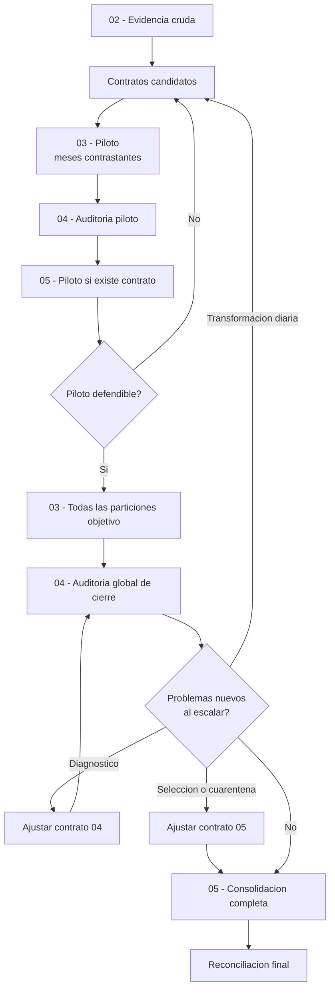

# Guia operativa del pipeline climatico

**Actualizado:** 23 de julio de 2026
**Estado:** vigente  
**Objetivo operativo actual:** producir datos climaticos diarios curados de
Boyaca y Cundinamarca para 2024 y 2025

Este documento es la entrada tecnica para integrantes y asistentes de IA que
trabajen en el pipeline. No se debe habilitar una variable nueva copiando reglas
de otra ni interpretar una celda ejecutada como prueba suficiente de calidad.

## Por que existen dos auditorias

Los datos cambian de significado al pasar de observaciones subdiarias a valores
diarios. Por eso se audita antes y despues de transformar:

```mermaid
flowchart TD
    API[API Socrata por variable y particion]
    P01[01 - Descarga]
    RAW[(clima_crudo<br/>Parquet inmutable)]
    P02[02 - Auditoria cruda]
    AUDIT_RAW[(auditorias_climaticas<br/>inventario y evidencia)]
    GATE_RULES{Contrato de variable<br/>y pruebas aprobados?}
    BLOCKED[⚠ Variable bloqueada<br/>faltan reglas y evidencia]
    RULES03[Rules.py + pruebas<br/>contrato de transformacion]
    P03[03 - Procesamiento diario<br/>todas las filas de la particion]
    DAILY_SENSOR[(clima_diario_sensor<br/>estacion + sensor + dia)]
    RULES04[DailyAudit.py + pruebas<br/>contrato de diagnostico]
    P04[04 - Auditoria diaria]
    AUDIT_DAILY[(auditorias_clima_diario<br/>calendario, cobertura y sensores)]
    MISSING[Ausencias = NaN + calidad<br/>no imputacion silenciosa]
    GATE_DAILY{Cobertura, extremos y<br/>sensores defendibles?}
    RULES05[DailyConsolidation.py + pruebas<br/>seleccion y cuarentenas]
    P05[05 - Consolidacion con<br/>reglas propias de la variable]
    CURATED[(clima_diario_curado<br/>estacion + dia + calidad)]
    P06[06 - Auditoria geografica<br/>y mapa de estaciones]
    GEO[(geografia_curada<br/>asignacion estacion-municipio)]
    GATE_GEO{Asignacion canonica<br/>validada con poligonos?}
    P07[07 - Agregacion<br/>municipio-dia]
    MUNICIPAL[(municipio + dia<br/>valor y cobertura)]
    P08[08 - Indicadores<br/>municipio-periodo]
    GATE_IMPUTE{Imputacion aporta valor<br/>y fue validada temporalmente?}
    IMPUTE[Capa imputada versionada<br/>valor + metodo + bandera]
    FEATURES[(indicadores<br/>municipio-periodo)]

    API --> P01 --> RAW --> P02 --> AUDIT_RAW --> GATE_RULES
    GATE_RULES -- No --> BLOCKED
    BLOCKED -. ampliar auditoria 02 .-> P02
    GATE_RULES -- Si --> RULES03 --> P03 --> DAILY_SENSOR --> RULES04 --> P04
    P04 --> AUDIT_DAILY --> GATE_DAILY
    AUDIT_DAILY -. materializa calendario .-> MISSING
    GATE_DAILY -- Ajustar transformacion --> RULES03
    GATE_DAILY -- Ajustar diagnostico --> RULES04
    GATE_DAILY -- Aprobar reglas de curado --> RULES05 --> P05 --> CURATED
    CURATED --> P06 --> GEO --> GATE_GEO
    GATE_GEO -- No --> P06
    GATE_GEO -- Si --> P07 --> MUNICIPAL --> GATE_IMPUTE
    GATE_IMPUTE -- No o no justificada --> P08 --> FEATURES
    GATE_IMPUTE -- Si --> IMPUTE --> P08

    classDef data fill:#e8f0e8,stroke:#315a3b,color:#17351e;
    classDef process fill:#e8eef5,stroke:#365b7d,color:#18344d;
    classDef gate fill:#fff1cc,stroke:#9b6a00,color:#4f3600;
    classDef blocked fill:#f9dddd,stroke:#a33b3b,color:#5c1717;
    class RAW,AUDIT_RAW,DAILY_SENSOR,AUDIT_DAILY,CURATED,GEO,MUNICIPAL,FEATURES data;
    class P01,P02,RULES03,P03,RULES04,P04,RULES05,P05,P06,P07,P08,IMPUTE process;
    class GATE_RULES,GATE_DAILY,GATE_GEO,GATE_IMPUTE gate;
    class BLOCKED,MISSING blocked;
```

La auditoria 02 responde si la fuente puede transformarse y como debe hacerse.
La auditoria 04 responde si la transformacion produjo una serie diaria
defendible. Ninguna reemplaza a la otra. Las flechas de retorno son
deliberadas: un hallazgo puede exigir modificar el contrato y repetir el piloto
antes de consolidar o escalar.

Los contratos tambien estan separados por etapa. `Rules.py` decide como pasar
de observaciones subdiarias a estacion-sensor-dia; `DailyAudit.py` decide que
diagnosticar; `DailyConsolidation.py` decide seleccion de sensores, cobertura y
cuarentenas. Una correccion de 05 no obliga a reprocesar 03 si la suma o
estadistica diaria original sigue siendo trazable.

## Del piloto a la escala completa

Cada variable atraviesa dos ciclos. Auditar unos meses no autoriza por si solo
la historia completa.

### Ciclo 1: piloto

Se eligen meses y territorios contrastantes, no solamente los mas faciles. Para
el objetivo actual se priorizan enero y febrero de 2025 en Boyaca y
Cundinamarca, porque febrero presenta una caida transversal de actividad.

El piloto permite comprobar semantica, duplicados, conflictos, cadencia,
cobertura, sensores paralelos y salidas. Si falla, se ajusta el contrato y se
repite solo este subconjunto. Todavia no se procesan los 48 meses objetivo.

### Compuerta para escalar

La escala se autoriza cuando:

- Las particiones piloto tienen manifiesto `COMPLETA`.
- La transformacion diaria conserva significado y trazabilidad.
- La auditoria diferencia dato observado, ausencia y baja cobertura.
- Los extremos y sensores paralelos tienen una politica candidata defendible.
- Un piloto de 05, cuando exista, conserva motivos y no imputa silenciosamente.

### Ciclo 2: escala y cierre

Primero se ejecuta 03 sobre todas las particiones objetivo. Despues 04 vuelve a
auditar la historia completa; no se extrapolan las conclusiones del piloto. Esa
auditoria global puede revelar cambios de sensor, periodos ausentes o anomalías
que no aparecieron en la muestra.

Un hallazgo no obliga automaticamente a empezar desde cero:

- Si cambia la estadistica diaria, se vuelve a `Rules.py`, 03 y las etapas
  dependientes.
- Si cambia solamente el diagnostico, se ajusta `DailyAudit.py` y se repite 04.
- Si cambia seleccion, calibracion o cuarentena de sensores, se ajusta
  `DailyConsolidation.py` y se repite 05.
- Los productos anteriores se reutilizan solo cuando su contrato sigue siendo
  valido y su trazabilidad permite demostrarlo.

La variable termina la escala cuando 05 reconcilia todas las particiones,
llaves, calidades, reglas y manifiestos. `COMPLETA` en una particion aislada no
equivale a este cierre global.

## Responsabilidad y compuerta de cada paso

### 01. Descargar sin reinterpretar

**Entrada:** API Socrata filtrada por variable, departamento, ano y mes.  
**Salida:** `clima_crudo/.../part-*.parquet`.  
**Garantia:** conserva los valores de la fuente y permite reanudar lotes.  
**No garantiza:** calidad, continuidad ni semantica correcta del sensor.

Compuerta antes de 02:

- Rutas canonicas y fuente correcta.
- Partes consecutivas y ultimo lote menor de 1.000 cuando corresponda.
- Manifiesto o resumen de tiempo, filas y bytes.
- Los crudos nunca se corrigen ni se sobrescriben para limpiar datos.

### 02. Auditar la fuente cruda

**Entrada:** Parquet crudos.  
**Salida:** inventarios, tablas diagnosticas y Markdown en
`auditorias_climaticas`.  
**Proposito:** descubrir el contrato que necesita la variable.

La auditoria revisa:

- Presencia y tipos de las 13 columnas esperadas por archivo.
- Filas, partes, meses y fechas internas de las particiones.
- Unidades, conversiones, nulos y rangos en muestra estratificada.
- Duplicados exactos y conflictos de clave en muestra.
- Cadencias por estacion-sensor, sensores paralelos y actividad mensual.
- Variacion de nombres, municipios y coordenadas.

Limitacion: varias metricas son muestrales. Un resultado sin conflictos en 02 no
demuestra que todos los millones de filas carezcan de conflictos. El paso 03
vuelve a validar todas las filas de cada particion procesada.

Compuerta antes de crear reglas:

- Dataset, unidad, sensores y significado de `valorobservado` confirmados.
- Agregacion diaria candidata justificada para esa variable.
- Tratamiento explicito de duplicados, conflictos, rangos y cadencia.
- Riesgos y limites de la auditoria escritos en `docs/climate_audits/`.

### Contrato de variable

Cada variable necesita un archivo `<Variable>Rules.py` y pruebas. El contrato
define columnas, fuente, unidad, sensores admitidos, valores rechazados,
deduplicacion, conflictos, cadencia y estadisticos diarios.

| Variable | Contrato | Estado |
|---|---|---|
| Precipitacion | `PrecipitationRules.py` | Validado en piloto |
| Temperatura ambiente/minima/maxima | `TemperatureRules.py` | Implementado; piloto real pendiente |
| Humedad | `HumidityRules.py` | ⚠️ Marcador bloqueante; reglas pendientes |
| Presion atmosferica | `AtmosphericPressureRules.py` | ⚠️ Marcador bloqueante; reglas pendientes |
| Velocidad del viento | `WindSpeedRules.py` | ⚠️ Marcador bloqueante; reglas pendientes |

Los marcadores pendientes detienen 03 con `NotImplementedError`. No se reemplazan
por un promedio generico para conseguir que el notebook termine.

### 03. Procesar todas las filas de una particion

**Entrada:** un departamento, ano y mes de `clima_crudo`.  
**Salida:** una fila por `estacion + sensor + dia` y auxiliares trazables.

Este paso:

- Exige las columnas del contrato y falla si falta alguna.
- Normaliza tipos sin modificar el crudo.
- Rechaza unidad, fuente, sensor, fecha o valor incompatibles.
- Deduplica exactamente y elimina claves repetidas con el mismo valor.
- Excluye claves con valores conflictivos y las exporta; nunca las promedia.
- Infiere cadencia por estacion-sensor.
- Agrega segun la variable y mantiene separados sensores paralelos.
- Registra filas de entrada, validas, rechazadas, duplicadas y conflictivas.
- Solo marca el manifiesto `COMPLETA` despues de verificar todas las salidas.

Compuerta antes de 04:

- Todas las particiones elegidas tienen manifiesto `COMPLETA`.
- No existen llaves `estacion + sensor + fecha` duplicadas en la salida.
- El balance de filas explica entrada, rechazos, duplicados, conflictos y
  observaciones agregadas.
- La regla y el commit aparecen en el manifiesto.

### 04. Auditar la serie diaria preliminar

**Entrada:** particiones `COMPLETA` de 03.  
**Salida:** calendario por estacion-sensor, cobertura, extremos, comparaciones y
reporte en `auditorias_clima_diario`.

Esta auditoria detecta:

- Dias observados y ausentes sin confundir `NaN` con cero.
- Cobertura diaria frente a la cadencia inferida.
- Coberturas mayores a 100 %, dias parciales y ausencias por fecha. La brecha
  consecutiva maxima debe incorporarse al resumen de cierre antes de escalar.
- Valores y amplitudes candidatos para revision, sin borrarlos.
- Concordancia o discrepancia entre sensores paralelos.
- Cambios territoriales, mensuales y entre periodos piloto.

La auditoria de precipitacion `v2` construye un catalogo de estaciones-sensores
a partir de ambos anos. Considera esperado cada par entre su primer y ultimo mes
observado y asi detecta huecos mensuales internos sin asumir actividad antes del
alta ni despues de la ultima aparicion. Esta regla no demuestra si una estacion
debio existir fuera de esos limites; esa incertidumbre se conserva para la
geografia canonica. Las demas variables deben implementar y probar una politica
equivalente antes de cerrar su historia.

Cada variable tiene un modulo `<Variable>DailyAudit.py` separado de sus reglas
del paso 03. Precipitacion y temperatura ya poseen auditores implementados;
humedad, presion y viento tienen marcadores que detienen 04 con
`NotImplementedError`. Para habilitarlos no basta con copiar el auditor de otra
variable: primero se revisa evidencia real de 03 y se definen sus rangos,
extremos, continuidad, cobertura y politica de sensores.

Compuerta antes de 05:

- Umbral de cobertura y tolerancia superior aprobados por variable.
- Extremos y patrones instrumentales distinguidos de eventos plausibles.
- Regla para sensores paralelos justificada.
- Politica para ausencias y estaciones completamente faltantes definida.
- Pilotos contrastantes aprobados en ambos departamentos.

### 05. Consolidar por estacion

El paso selecciona o combina sensores solo mediante reglas aprobadas y produce
una fila por estacion-dia con valor, calidad, motivo y procedencia. Actualmente
solo precipitacion tiene consolidacion implementada. Temperatura no debe usar
`PrecipitationDailyConsolidation.py`.

### 06. Auditar la geografia de estaciones

**Entrada:** historia `clima_diario_curado`, catalogo IDEAM y DIVIPOLA.
**Salida:** catalogo de estaciones, asignaciones candidatas, revisiones,
exclusiones de alcance, mapa y manifiesto en `geografia_curada`.

El paso 06 compara codigos, nombres y coordenadas sin alterar las fuentes y
valida los puntos IDEAM contra poligonos municipales. No declara una asignacion
canonica solo por coincidencia de texto: exige un unico poligono y ausencia de
contradiccion con un codigo conocido. El paso 07 consume solo asignaciones
canonicas; las revisiones y exclusiones permanecen separadas y trazables.
Bogota D.C. queda fuera del alcance aun si la fuente la agrupa bajo
Cundinamarca. El contrato
operativo se detalla en
[`climate_geography_audit.md`](climate_geography_audit.md).

### 07. Agregar a municipio-dia

**Entrada:** `clima_diario_curado` y asignacion estacion-municipio canonica.
**Salida:** una fila por variable, municipio y dia con valor y cobertura.

Este paso combina estaciones despues de la reduccion diaria. Conserva numero de
estaciones esperadas y observadas, dispersion, calidad y ausencias; no convierte
`NaN` en cero ni usa estaciones en revision como si estuvieran confirmadas.

Para precipitacion, el contrato piloto construye los 239 municipios y usa la
mediana no ponderada cuando al menos 50 % de las estaciones esperadas en esa
fecha tienen valor aceptado. Conserva tambien media, extremos, desviacion, IQR y
rango. Los municipios sin red permanecen en el calendario con `NaN`; esto hace
visible la cobertura espacial antes del cruce con EVA. El contrato se detalla en
[`climate_municipal_aggregation.md`](climate_municipal_aggregation.md).

Antes del paso 08, `07_2_Climate_Precipitation_MunicipalAudit.ipynb` revisa cobertura por mes,
semestre y ano, brechas sin valor, dias con cobertura insuficiente y
sensibilidad media-mediana. Es una auditoria de solo lectura y su contrato se
detalla en [`climate_municipal_audit.md`](climate_municipal_audit.md).

### 08. Construir indicadores municipio-periodo

**Entrada:** `clima_municipal`.
**Salida:** caracteristicas por municipio y periodo agricola.

Las estadisticas dependen de la variable. Para precipitacion incluyen acumulado,
dias con lluvia, intensidad, extremos y rachas; para otras variables se definen
contratos propios. Toda salida conserva dias esperados, dias validos, cobertura y
criterio de aceptacion.

## Protocolo para escalar 2024-2025

1. Ejecutar inventario estructural de 02 para confirmar dos departamentos, dos
   anos y doce meses por variable.
2. Auditar con 02 meses contrastantes, incluidos enero y febrero de 2025, y al
   menos una muestra de 2024.
3. Crear o ajustar el contrato con pruebas unitarias y un piloto de 03.
4. Ejecutar 03 y 04 para enero-febrero de 2025 en ambos departamentos.
5. Aprobar el contrato de 05 con evidencia del piloto.
6. Procesar 2024-2025 por particiones independientes y manifiestos reanudables.
7. Ejecutar una auditoria diaria de cierre por variable, departamento, ano y
   mes; no basta con auditar solo el piloto.
8. Construir el catalogo esperado de estaciones-sensores y detectar meses
   completamente ausentes por par.
9. Reconciliar las 48 particiones esperadas por variable: dos departamentos,
   dos anos y doce meses.
10. Publicar resumen de cobertura, brecha maxima, estaciones, rechazos,
    conflictos y cambios de regla antes de pasar a municipio.

Las auditorias cubren los problemas conocidos de esquema, duplicacion,
conflictos, frecuencia, cobertura y sensores, pero no son una garantia magica
contra problemas nuevos. La defensa al escalar es repetir controles sobre cada
particion, conservar manifiestos y ejecutar una auditoria global de cierre.

## Politica de datos faltantes

La politica vigente es **no imputar en 01, 02 ni 03**.

- Un cero observado es un dato; una ausencia es `NaN`.
- 03 solo contiene dias con alguna observacion valida.
- 04 materializa el calendario y deja los dias ausentes en `NaN`.
- 05 conserva `NaN` cuando no hay cobertura suficiente, hay desacuerdo de
  sensores o el sensor esta en cuarentena.
- No se multiplica una suma parcial por el inverso de la cobertura.
- No se interpola precipitacion faltante: hacerlo fabricaria lluvia.

Opciones que pueden evaluarse despues, sin aprobarlas todavia:

- Para temperatura, humedad o presion, comparar una version sin imputacion con
  interpolacion temporal limitada a brechas muy cortas, siempre con bandera
  `es_imputado`, metodo y distancia al dato observado.
- Usar estaciones cercanas solo despues de validar geografia, altitud,
  correlacion y disponibilidad historica.
- Calcular indicadores de periodo unicamente si superan cobertura minima; si no,
  conservar `NaN` y calidad insuficiente.
- En modelado, ajustar cualquier imputador solo con el conjunto de entrenamiento
  de cada corte temporal y agregar indicadores de ausencia para evitar fuga.
- Comparar metricas con y sin imputacion. Se adopta una tecnica solo si mejora
  validacion temporal sin borrar el patron de faltantes.

La imputacion es una fase explicita y versionada, no una correccion silenciosa
dentro del procesamiento diario.

Para precipitacion, la politica candidata sigue siendo no interpolar lluvia.
Primero se intenta conservar otra estacion o sensor defendible y se calcula la
cobertura del municipio-periodo. Un periodo sin cobertura suficiente permanece
en `NaN`. Para variables continuas como temperatura, humedad o presion se puede
evaluar una capa imputada separada, pero el producto observado nunca se
sobrescribe.

## Instrucciones para asistentes de IA

Antes de modificar 03 a 08:

1. Leer `project_status.md`, esta guia, `data_artifacts.md` y la auditoria de la
   variable.
2. Confirmar el alcance 2024-2025 y ambos departamentos.
3. Identificar si la regla esta validada, en piloto o bloqueada.
4. No habilitar una variable bloqueada sin auditoria, contrato y pruebas.
5. No reutilizar umbrales ni agregaciones de otra variable.
6. Mantener crudos inmutables, banderas en `False` y manifiestos atomicos.
7. Proponer y documentar cambios de contrato antes de escalar.
8. No declarar geografias candidatas como canonicas sin evidencia espacial.
