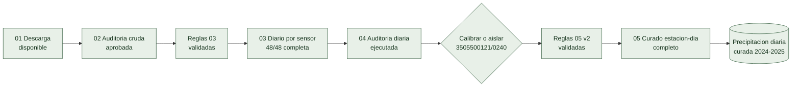

# Estado del pipeline: precipitacion

**Actualizado:** 28 de julio de 2026
**Estado:** en proceso  
**Fuente:** `s54a-sgyg`  
**Alcance objetivo:** Boyaca y Cundinamarca, enero de 2024 a diciembre de 2025

## Resumen ejecutivo

El contrato diario de precipitacion fue validado de extremo a extremo en cuatro
particiones piloto. Las **48 particiones mensuales** del objetivo 2024-2025
terminaron el paso 03 y producen 42.190 filas estacion-sensor-dia. El paso 04
termino sobre las 48, diagnostico un cambio temporal de escala y el paso 05 v2
ya genero y reconcilio la capa diaria curada.

La variable completo el curado diario 2024-2025 y no necesita repetir descarga,
procesamiento ni auditoria. La capa puede pasar al diseno del paso 06, que
requiere geografia canonica y reglas de agregacion municipal.

## 01. Descarga cruda

**Estado de etapa:** `[P]` disponible estructuralmente; integridad final pendiente.

- [X] Fuente oficial seleccionada: `s54a-sgyg`.
- [X] Alcance territorial fijado en Boyaca y Cundinamarca.
- [X] Carpetas mensuales presentes para 2024 y 2025 en ambos departamentos.
- [X] Los crudos se conservan inmutables en `clima_crudo`.
- [ ] Reconciliar partes consecutivas y ultimo lote de las 48 particiones.
- [ ] Confirmar fechas internas y ausencia de archivos incompletos en todo el alcance.
- [ ] Publicar un resumen final de filas, bytes y manifiestos de descarga.

## 02. Auditoria de datos crudos

**Estado de etapa:** `[X]` evidencia aprobada para escalar 2024-2025.

- [X] Auditados 2021, 2023 y 2025 en ambos departamentos.
- [X] Auditadas muestras estratificadas de los doce meses de 2024 en ambos departamentos.
- [X] Identificados duplicados exactos, cadencias de 2, 10 y 60 minutos y sensores paralelos.
- [X] Confirmada la ausencia transversal del 5 al 25 de febrero de 2025.
- [X] Identificado el patron instrumental sospechoso `0035215030` / `0240`.
- [X] Confirmadas tambien cadencias de 1 minuto en 2024, ya admitidas por el contrato.
- [X] Comparado 2024 contra los patrones que sustentan el contrato vigente.
- [X] Publicada la sintesis de cierre de la auditoria cruda de 2024.

Evidencia:

- [`../climate_audits/02_datos_crudos/auditoria_precipitacion_boyaca_2021_2023.md`](../climate_audits/02_datos_crudos/auditoria_precipitacion_boyaca_2021_2023.md)
- [`../climate_audits/02_datos_crudos/auditoria_precipitacion_boyaca_2025.md`](../climate_audits/02_datos_crudos/auditoria_precipitacion_boyaca_2025.md)
- [`../climate_audits/02_datos_crudos/auditoria_precipitacion_cundinamarca_2021_2023.md`](../climate_audits/02_datos_crudos/auditoria_precipitacion_cundinamarca_2021_2023.md)
- [`../climate_audits/02_datos_crudos/auditoria_precipitacion_cundinamarca_2025.md`](../climate_audits/02_datos_crudos/auditoria_precipitacion_cundinamarca_2025.md)
- [`../climate_audits/02_datos_crudos/auditoria_precipitacion_2024.md`](../climate_audits/02_datos_crudos/auditoria_precipitacion_2024.md)
- [`../climate_audits/transversales/alerta_cobertura_febrero_2025.md`](../climate_audits/transversales/alerta_cobertura_febrero_2025.md)

## Contrato de variable

**Estado de etapa:** `[X]` validado para el piloto.

- [X] `PrecipitationRules.py` define fuente, unidad, sensores y columnas.
- [X] Los valores se interpretan como incrementos del intervalo y se suman por dia.
- [X] Duplicados exactos y repeticiones equivalentes se eliminan con trazabilidad.
- [X] Conflictos de una misma clave se excluyen; no se promedian.
- [X] Valores negativos y filas incompatibles se rechazan y exportan.
- [X] Las reglas cuentan con pruebas automatizadas.
- [ ] Reabrir el contrato solo si la auditoria 2024 descubre un patron no cubierto.

## 03. Diario por estacion y sensor

**Estado de etapa:** `[X]` 48 de 48 particiones objetivo terminadas.

- [X] Boyaca 2025-01: manifiesto `COMPLETA`.
- [X] Boyaca 2025-02: manifiesto `COMPLETA`.
- [X] Cundinamarca 2025-01: manifiesto `COMPLETA`.
- [X] Cundinamarca 2025-02: manifiesto `COMPLETA`.
- [X] Procesadas las 24 particiones de 2024.
- [X] Procesadas las 20 particiones restantes de 2025.
- [X] Reconciliados exactamente 48 manifiestos `COMPLETA`, sin faltantes ni duplicados.
- [X] Verificados 42.190 registros diarios declarados por los manifiestos.
- [X] Las cuatro particiones piloto conservan el commit `75b24d9`; las 44 nuevas usan `9dff0aa`.
- [ ] Resumir globalmente balances, rechazos, duplicados y conflictos durante el cierre de 04.

No se imputan dias ni observaciones en este paso. Las salidas viven en
`clima_diario_sensor/variable=precipitacion/fuente=s54a-sgyg/`.

## 04. Auditoria diaria

**Estado de etapa:** `[X]` cierre aprobado para 05 v2.

- [X] Auditadas las cuatro particiones piloto de enero-febrero de 2025.
- [X] Calendario materializado con ausencias como `NaN`, no como cero.
- [X] Evaluadas cobertura, cadencia, extremos y concordancia de sensores paralelos.
- [X] Ventana piloto de cobertura definida entre 90 % y 102 %.
- [X] Implementado el catalogo esperado por intervalo activo en `auditoria_precipitacion_diaria_v2`.
- [X] Auditadas las 48 particiones procesadas del objetivo 2024-2025.
- [X] Ejecutado el catalogo esperado de 130 estaciones-sensores usando ambos anos.
- [X] Detectadas 102 ausencias de mes completo dentro de intervalos activos.
- [X] Resumidas cobertura, continuidad, extremos y discrepancias por particion.
- [X] Confirmada la cuarentena de `0035215030` / `0240`.
- [X] Diagnosticado el cambio de escala de `3505500121` / `0240` alrededor del 22 de julio de 2025.
- [X] Validada la correccion temporal `factor=0,1` entre `2024-10-29` y `2025-07-21`.
- [X] Aprobada la version 2 de las reglas antes de consolidar a escala.

Evidencia:

- [`../climate_audits/04_series_diarias/auditoria_piloto_diario_precipitacion_2025.md`](../climate_audits/04_series_diarias/auditoria_piloto_diario_precipitacion_2025.md)
- [`../climate_audits/04_series_diarias/auditoria_cierre_diario_precipitacion_2024_2025.md`](../climate_audits/04_series_diarias/auditoria_cierre_diario_precipitacion_2024_2025.md)

## 05. Consolidacion diaria por estacion

**Estado de etapa:** `[X]` cierre 2024-2025 completo y reconciliado.

- [X] Consolidado enero-febrero de 2025 para ambos departamentos.
- [X] Llave unica `estacion + dia` verificada en 5.198 filas piloto.
- [X] Ausencias, baja cobertura, cuarentenas y desacuerdos conservan `NaN`.
- [X] Sensores paralelos no se suman ni se promedian.
- [X] Sensor `0035215030` / `0240` puesto en cuarentena en el piloto.
- [X] Simulacion de solo lectura completada sobre las 48 particiones: 53.128 filas estacion-dia.
- [X] Calibracion temporal de `3505500121` / `0240` conserva original, ajustado, factor, motivo y evidencia.
- [X] Cuarentena de `0035215030` / `0240` limitada al intervalo con evidencia; periodos confiables sobreviven.
- [X] Consolidadas las 48 particiones aprobadas por la auditoria diaria.
- [X] Reconciliadas 53.128 filas, calidad, procedencia y cero llaves duplicadas.
- [X] Publicados manifiesto y reporte de cierre 2024-2025.

Contrato y evidencia:

- [`../climate_daily_consolidation.md`](../climate_daily_consolidation.md)
- [`../climate_audits/05_clima_curado/auditoria_curado_precipitacion_2024_2025.md`](../climate_audits/05_clima_curado/auditoria_curado_precipitacion_2024_2025.md)

## 06. Geografia de estaciones

**Estado de etapa:** `[X]` cierre espacial v3 verificado.

- [X] Implementado `06_ClimateGeographyAudit.ipynb` con ejecucion protegida.
- [X] Validado el cruce exacto de 126 estaciones climaticas con el catalogo IDEAM.
- [X] Implementado el mapa de puntos y la exportacion en una carpeta propia.
- [X] Las coincidencias por catalogo se etiquetan como candidatas, no canonicas.
- [X] Ejecutado y persistido el cierre geografico
  `estaciones_precipitacion_2024_2025_v1`.
- [X] Verificadas 126 estaciones unicas: 111 verdes y 15 para revision.
- [X] Conseguido y validado `DivipolaGeo.gpkg`: 239 poligonos validos en
  `EPSG:4326`, concordantes con DIVIPOLA.
- [X] Implementado punto-en-poligono y salida canonica separada.
- [X] Ejecutado y persistido `estaciones_precipitacion_2024_2025_v2` en Drive:
  116 asignaciones canonicas y 10 estaciones no canonicas.
- [X] Confirmado que Bogota no entra al catalogo canonico.
- [X] Implementada v3 para separar una exclusion de alcance de las revisiones.
- [X] Ejecutado y persistido `estaciones_precipitacion_2024_2025_v3` en Drive:
  116 asignaciones canonicas, 9 revisiones y 1 exclusion.
- [P] Resolver o documentar las 9 estaciones en revision geografica en
  paralelo; no ingresan al paso 07 mientras sigan pendientes.

Contrato:

- [`../climate_geography_audit.md`](../climate_geography_audit.md)
- [`../climate_audits/06_geografia/auditoria_geografica_precipitacion_2024_2025.md`](../climate_audits/06_geografia/auditoria_geografica_precipitacion_2024_2025.md)

## 07. Municipio diario

**Estado de etapa:** `[P]` contrato v1 implementado y prevalidado localmente.

- [X] Definida mediana no ponderada como estadistica principal del piloto.
- [X] Implementado calendario de 239 municipios para 2024-2025.
- [X] Implementada cobertura contra estaciones esperadas en cada fecha.
- [X] Conservadas media, mediana, extremos, desviacion, IQR, rango y codigos de
  estaciones contribuyentes.
- [X] Mantenido `NaN` sin imputacion cuando no existe evidencia suficiente.
- [X] Prevalidada persistencia local: 48 particiones y 174.709 filas.
- [ ] Ejecutar y auditar la corrida oficial en Colab.

Contrato:

- [`../climate_municipal_aggregation.md`](../climate_municipal_aggregation.md)

## 08. Indicadores por periodo

**Estado de etapa:** `[ ]` pendiente de 07.

- [ ] Definir indicadores por periodo agricola: acumulado, dias con lluvia, intensidad y brechas.
- [ ] Conservar `NaN` cuando la cobertura sea insuficiente; no extrapolar acumulados.

## Siguiente bloque recomendado

1. Ejecutar el piloto 07 en Colab y comprobar las cifras de prevalidacion.
2. Revisar en paralelo los siete conflictos entre catalogo IDEAM y poligono.
3. Revisar los dos puntos cercanos a limites; Bogota ya esta excluida.
4. Avanzar en paralelo con el piloto de temperatura sin copiar reglas de lluvia.

## Plan de ejecucion del paso 03

Los cuatro bloques tienen volumen semejante y no se solapan. Enero y febrero de
2025 no se incluyen porque sus cuatro particiones piloto ya estan `COMPLETA`.

| Estado | Worker sugerido | Departamento | Ano | Meses | Particiones | Filas crudas aproximadas |
|---|---|---|---:|---|---:|---:|
| `[X]` | `w_precip_boyaca_2024` | Boyaca | 2024 | 1-12 | 12 | 1.716.496 |
| `[X]` | `w_precip_cundinamarca_2024` | Cundinamarca | 2024 | 1-12 | 12 | 1.866.195 |
| `[X]` | `w_precip_boyaca_2025_m03_m12` | Boyaca | 2025 | 3-12 | 10 | 1.919.746 |
| `[X]` | `w_precip_cundinamarca_2025_m03_m12` | Cundinamarca | 2025 | 3-12 | 10 | 1.916.182 |

Configuracion comun: `MAX_PARTICIONES=None`,
`SOBRESCRIBIR_RESULTADOS=False` y primero
`EJECUTAR_PROCESAMIENTO=False` para revisar el plan. Cada cuenta cambia despues
la bandera a `True`, reejecuta la celda de configuracion para actualizar el
valor en memoria y finalmente ejecuta la celda protegida.
