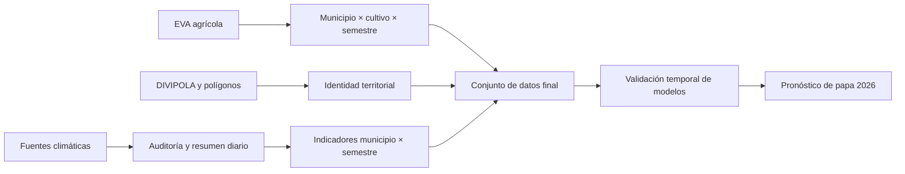

# Análisis del proceso de datos y pronóstico de rendimiento de papa para 2026

**Documento para presentación**

**Actualizado:** 30 de julio de 2026

**Territorio:** Boyacá y Cundinamarca

Este proyecto es la alternativa presentada por el **equipo 65** al concurso
**“Datos al Ecosistema 2026: IA para Colombia”**, en la categoría avanzada
**“Inteligencia Artificial aplicada a datos abiertos”**.

**Pregunta central:** ¿qué rendimiento, medido en toneladas de papa por
hectárea, puede esperarse en los semestres A y B de 2026 para los diez
municipios con mayor área sembrada reciente de cada departamento?

Este documento sigue el orden solicitado para presentar la solución: problema,
fuentes, auditoría de calidad, conciliación temporal, geografía, conjunto de
datos final, elección del modelo y resultado del pronóstico.

## 1. Descripción del problema

El rendimiento agrícola relaciona la producción obtenida con el área
cosechada. Anticiparlo puede ayudar a orientar revisiones de abastecimiento,
asistencia técnica y seguimiento territorial. El reto no consiste solamente en
entrenar un modelo: primero hay que demostrar que los datos de clima, cultivos y
geografía pueden compararse sin crear información artificial.

La primera versión se concentra en papa por tres razones:

1. fue el cultivo semestral con mayor área sembrada acumulada entre 2022 y 2024;
2. aparece en 155 municipios del territorio estudiado;
3. la fuente oficial ofrece historia municipal para 2019–2025, suficiente para
   hacer una validación temporal básica.


El resultado esperado son 40 pronósticos:

```text
2 departamentos
× 10 municipios por departamento
× 2 semestres de 2026
= 40 pronósticos municipales
```

El proceso completo fue:



## 2. Conjuntos de datos utilizados y origen

Se usaron fuentes diferentes porque ninguna cubre por sí sola el problema
completo. Las Evaluaciones Agropecuarias Municipales (EVA) describen cultivos;
el Instituto de Hidrología, Meteorología y Estudios Ambientales (IDEAM) aporta
mediciones de estaciones; la Unidad de Planificación Rural Agropecuaria (UPRA)
publica la base agrícola consolidada; y el Departamento Administrativo Nacional
de Estadística (DANE) mantiene la codificación territorial.

| Fuente | Proveedor y origen | Período utilizado | Función en la solución |
|---|---|---|---|
| Catálogo nacional de estaciones climáticas | IDEAM, dataset Socrata [`hp9r-jxuu`](https://www.datos.gov.co/d/hp9r-jxuu) | catálogo consultado en 2026; mediciones analizadas de 2024–2025 | Identificar y localizar las estaciones usadas en la auditoría climática |
| EVA municipal de exploración | API Socrata [`uejq-wxrr`](https://www.datos.gov.co/d/uejq-wxrr) | 2022–2024 | Auditar cultivos, agregados, cambios y mapas |
| Base Agrícola EVA | [UPRA](https://upra.gov.co/es-co/eva), archivo oficial `20260526_BaseAgricola20192025.xlsx` | 2019–2025 | Variable de rendimiento usada para entrenar y evaluar |
| NASA POWER Daily API | [NASA POWER](https://power.larc.nasa.gov/docs/services/api/temporal/daily/) | 2019–30 de julio de 2026 | Historia climática continua para todos los municipios del modelo |
| DIVIPOLA | [DANE](https://www.dane.gov.co/index.php/sistema-estadistico-nacional-sen/normas-y-estandares/nomenclaturas-y-clasificaciones/nomenclaturas/codificacion-de-la-division-politica-administrativa-de-colombia-divipola) | catálogo vigente usado por el proyecto | Código único de departamento y municipio |
| Límites político-administrativos (alternativa trazable) | [IGAC - Colombia en Mapas](https://mapas2.igac.gov.co/server/rest/services/limites/limites/MapServer) | servicio vigente consultado en 2026 | Polígonos oficiales de municipios y departamentos |
| Polígonos municipales | Archivo compartido `Boyaca_Cundinamarca_Municipios.gpkg` | 239 municipios | Validación punto-en-polígono y elaboración de mapas |

### Identificadores y URL de acceso

Los identificadores de los datasets climáticos publicados en Datos Abiertos son:

| Dataset | ID | URL de Datos Abiertos |
|---|---|---|
| Catálogo Nacional de Estaciones del IDEAM | `hp9r-jxuu` | [Catálogo oficial de estaciones](https://datos.gov.co/es/Ambiente-y-Desarrollo-Sostenible/Cat-logo-Nacional-de-Estaciones-del-IDEAM/hp9r-jxuu) |
| Precipitación | `s54a-sgyg` | [Dataset](https://www.datos.gov.co/d/s54a-sgyg) |
| Temperatura ambiente | `sbwg-7ju4` | [Dataset](https://www.datos.gov.co/d/sbwg-7ju4) |
| Temperatura mínima | `afdg-3zpb` | [Dataset](https://www.datos.gov.co/d/afdg-3zpb) |
| Temperatura máxima | `ccvq-rp9s` | [Dataset](https://www.datos.gov.co/d/ccvq-rp9s) |
| Velocidad del viento | `sgfv-3yp8` | [Dataset](https://www.datos.gov.co/d/sgfv-3yp8) |
| Presión atmosférica | `62tk-nxj5` | [Dataset](https://www.datos.gov.co/d/62tk-nxj5) |

Las URL principales usadas o documentadas por el pipeline son:

- **Catálogo Nacional de Estaciones del IDEAM:** dataset Socrata
  `hp9r-jxuu`, disponible en
  <https://www.datos.gov.co/d/hp9r-jxuu> y mediante la API
  <https://www.datos.gov.co/resource/hp9r-jxuu.json>.
- **UPRA:** página de EVA en <https://upra.gov.co/es-co/eva> y archivo exacto
  utilizado por `run_pipeline.py`:
  <https://upra.gov.co/sites/default/files/2026-05/20260526_BaseAgricola20192025.xlsx>.
- **NASA POWER Daily:** documentación en
  <https://power.larc.nasa.gov/docs/services/api/temporal/daily/> y endpoint
  de puntos utilizado por el pipeline:
  <https://power.larc.nasa.gov/api/temporal/daily/point>.
- **DIVIPOLA DANE:** página oficial de codificación en
  <https://www.dane.gov.co/index.php/sistema-estadistico-nacional-sen/normas-y-estandares/nomenclaturas-y-clasificaciones/nomenclaturas/codificacion-de-la-division-politica-administrativa-de-colombia-divipola>.
- **IGAC / Colombia en Mapas:** el servicio [Líneas Limítrofes y Entidades
  Territoriales](https://mapas2.igac.gov.co/server/rest/services/limites/limites/MapServer)
  contiene las dos capas necesarias: [municipios (capa
  1)](https://mapas2.igac.gov.co/server/rest/services/limites/limites/MapServer/1)
  y [departamentos (capa
  2)](https://mapas2.igac.gov.co/server/rest/services/limites/limites/MapServer/2).
  El identificador del servicio MapServer es `6d3ab67f9c534086adda070b5a3e0d9b`.
  Ambas son geometrías poligonales, exponen el código DANE y admiten consulta
  en JSON, GeoJSON y PBF. Las solicitudes reproducibles pueden usar:

  ```text
  https://mapas2.igac.gov.co/server/rest/services/limites/limites/MapServer/1/query?where=1%3D1&outFields=*&returnGeometry=true&outSR=4326&f=geojson
  https://mapas2.igac.gov.co/server/rest/services/limites/limites/MapServer/2/query?where=1%3D1&outFields=*&returnGeometry=true&outSR=4326&f=geojson
  ```

  El servicio publica los datos en el sistema espacial EPSG:9377; el parámetro
  `outSR=4326` permite obtenerlos en latitud/longitud, que es el sistema usado
  por `GeoData.ipynb`. El límite de 2.000 registros por consulta cubre la capa
  municipal completa en una solicitud.
- **Polígonos usados en `GeoData.ipynb`:** el notebook contiene la descarga de
  ArcGIS Open Data mediante
  <https://opendata.arcgis.com/api/v3/datasets/623a71c7f5c94bada0416879df0effe4_0/downloads/data?format=shp&spatialRefId=4326&where=1%3D1>.

  El identificador `ar93-k8h7` que aparece en algunas visualizaciones públicas
  corresponde a una vista derivada; para la procedencia de estaciones se usa el
  catálogo base de IDEAM (`hp9r-jxuu`) indicado en la tabla anterior.

`GeoData.ipynb` no descarga desde una URL los archivos `Divipola.csv`,
`Divipola_Municipios.json` ni `DivipolaGeo.gpkg`: los lee desde
`/content/drive/MyDrive/eco2026/`. Por ello, esos archivos deben considerarse
entradas compartidas de Drive y no descargas reproducibles del notebook. El
proveedor y la fecha original del GeoPackage final
`Boyaca_Cundinamarca_Municipios.gpkg` tampoco quedaron registrados; esa es una
pendiente de trazabilidad distinta de la validación de sus códigos y geometrías.

### Variables climáticas de estaciones

| Variable | Identificador en Datos Abiertos | Resumen diario |
|---|---|---|
| Precipitación | [`s54a-sgyg`](https://www.datos.gov.co/d/s54a-sgyg) | Suma de incrementos válidos |
| Temperatura ambiente | [`sbwg-7ju4`](https://www.datos.gov.co/d/sbwg-7ju4) | Media |
| Temperatura mínima | [`afdg-3zpb`](https://www.datos.gov.co/d/afdg-3zpb) | Mínimo |
| Temperatura máxima | [`ccvq-rp9s`](https://www.datos.gov.co/d/ccvq-rp9s) | Máximo |
| Velocidad del viento | [`sgfv-3yp8`](https://www.datos.gov.co/d/sgfv-3yp8) | Media |
| Presión atmosférica | [`62tk-nxj5`](https://www.datos.gov.co/d/62tk-nxj5) | Media |

Las estaciones IDEAM permiten estudiar la calidad y la disponibilidad local,
pero no ofrecen historia completa para todos los municipios desde 2019. Por
eso se usó [NASA POWER](https://power.larc.nasa.gov/docs/services/api/temporal/daily/)
en el conjunto de datos predictivo. Esta decisión mejora la comparabilidad
histórica, aunque la malla de NASA no sustituye el valor observacional de una
estación cercana.

La variable agrícola final proviene de la
[Base EVA de UPRA](https://upra.gov.co/es-co/eva). El rendimiento se
recalculó como producción total dividida por área cosechada total; no se
promediaron rendimientos de filas con tamaños diferentes.

## 3. Problemas de completitud y calidad de los datos

La auditoría separó dos preguntas:

- **completitud:** ¿existe la observación esperada?;
- **calidad:** si existe, ¿su esquema, valor, unidad y contexto son confiables?

### Completitud climática

La red de estaciones no tiene la misma cobertura en todos los municipios ni en
todos los días. El caso más visible fue una brecha común entre el 5 y el 25 de
febrero de 2025. Esa ausencia ya estaba en la fuente y no fue creada durante el
procesamiento.


Para precipitación se obtuvieron 116 estaciones con asignación municipal
canónica. Solo 84 de los 239 municipios contaban con una estación utilizable;
los otros 155 conservaron ausencia. En ningún caso se reemplazó “sin dato” por
cero, porque cero significaría que se observó un día sin lluvia.

### Calidad climática

| Problema | Qué podía causar | Tratamiento |
|---|---|---|
| Cadencias de 1, 2, 5, 10 o 60 minutos | Coberturas diarias incomparables | Inferir frecuencia dentro de cada día |
| Duplicados exactos | Contar dos veces una lectura | Conservar una copia y registrar el conteo |
| Misma llave con valores distintos | Promedio sin significado físico | Excluir el conflicto |
| Sensores paralelos | Tratar sensores como estaciones independientes | Compararlos y seleccionar con regla trazable |
| Valores fuera de rango | Distorsionar agregados | Marcar o rechazar; nunca recortar silenciosamente |
| Cambios de escala | Saltos artificiales | Corregir solo el intervalo demostrado y conservar el original |
| Coordenadas o etiquetas variables | Asignar una estación al municipio equivocado | Enviar a revisión geográfica |

La vista de un mes ayuda a distinguir comportamiento real, interrupciones y
diferencias de escala entre variables.


### Calidad agrícola

EVA puede contener varias filas para el mismo municipio, cultivo y período por
ciclo, estado físico o desagregación. También se encontraron:

- valores nulos, negativos o no finitos;
- área cosechada superior al área sembrada;
- producción con área cosechada no positiva;
- diferencias entre el rendimiento publicado y
  `producción / área cosechada`;
- 43 combinaciones incompatibles entre ciclo y período;
- 1.159 llaves con múltiples desagregaciones que debían conservar trazabilidad.

La consolidación produjo 13.692 filas municipio × cultivo × período a partir de
14.962 filas. El rendimiento agregado se calculó así:

```text
rendimiento_t_ha =
    producción_total_compatible_t
    / área_cosechada_total_compatible_ha
```

No se usaron producción ni área cosechada como predictores del modelo, porque
juntas revelarían directamente la respuesta y producirían una evaluación
artificialmente buena.

## 4. Diferencias entre las series climáticas y las series EVA

El clima y EVA funcionan con relojes diferentes.

| Dominio | Frecuencia original | Frecuencia conservada | Historia disponible |
|---|---|---|---|
| Estaciones IDEAM | Subdiaria e irregular | Estación-día y municipio-día | 2024–2025 |
| NASA POWER | Diaria por celda | Municipio-día | 2019–2026 |
| EVA | Semestre A, semestre B o año | Municipio × cultivo × período | 2019–2025 para el modelo |


Convertir un rendimiento semestral en 181 o 184 valores diarios repetiría la
misma cifra y daría una falsa impresión de abundancia. La solución siguió la
dirección contraria:

1. conservar el clima diario;
2. calcular indicadores dentro de cada semestre;
3. unir esos indicadores con el rendimiento EVA del mismo municipio, año y
   semestre.

Los indicadores incluyen precipitación acumulada, extremos, días húmedos,
racha seca, temperaturas, humedad, viento, presión, cobertura y tres bloques
temporales dentro del semestre.


### Longitud y quiebres de la historia

Cada municipio-semestre aporta como máximo siete rendimientos, uno por año entre
2019 y 2025. Son catorce observaciones si se cuentan ambos semestres, pero no
forman una única serie homogénea porque A y B representan ciclos distintos.


Además, UPRA advierte un cambio metodológico desde 2022: para cultivos
transitorios, área cosechada, producción y rendimiento pasaron a corresponder a
cosechas efectivas del período; antes se relacionaban con las siembras del
período de referencia. Un modelo puede confundir ese cambio con una señal
productiva o climática.

Para 2026 también hay una diferencia:

- 2026-A usa 181 días climáticos observados;
- 2026-B usa 27 días observados y 157 días completados con climatología
  2019–2025.

La climatología asigna a cada fecha futura el comportamiento típico de ese día
del calendario según los años anteriores; no intenta afirmar cuál será el clima
real.

Por tanto, 2026-B es un escenario condicionado a la fecha de corte, no un
semestre climático ya observado.

## 5. Problemas de datos espaciales

La palabra “municipio” no es una llave segura: puede haber tildes, abreviaturas,
nombres repetidos o etiquetas desactualizadas. La llave territorial utilizada
fue el código DANE definido por
[DIVIPOLA](https://www.dane.gov.co/index.php/sistema-estadistico-nacional-sen/normas-y-estandares/nomenclaturas-y-clasificaciones/nomenclaturas/codificacion-de-la-division-politica-administrativa-de-colombia-divipola).

### Proveedores y posibles discrepancias

Se reconciliaron tres representaciones:

1. el municipio declarado por el catálogo de estaciones IDEAM;
2. el código oficial DIVIPOLA del DANE;
3. el municipio espacial obtenido al ubicar las coordenadas de la estación
   dentro de un polígono.

El GeoPackage compartido contiene 239 polígonos válidos en EPSG:4326, el sistema
habitual de latitud y longitud: 123 de Boyacá y 116 de Cundinamarca. Sus códigos
coinciden con el catálogo DIVIPOLA usado en el proyecto. Sin embargo, el
repositorio no conserva la referencia al proveedor original ni la fecha de
descarga de esos polígonos. Esta ausencia de linaje debe corregirse en una
próxima versión, aunque la consistencia geométrica y de códigos sí fue
verificada. El servicio de límites del IGAC documentado arriba es una alternativa
oficial para reemplazar ese archivo compartido en una ejecución futura; antes de
adoptarlo se debe fijar la fecha de consulta y repetir la auditoría de códigos,
geometrías y número de municipios.

En la auditoría de 126 estaciones de precipitación:

| Resultado espacial | Estaciones |
|---|---:|
| Catálogo IDEAM y polígono coinciden | 112 |
| El polígono resolvió un nombre no resuelto por catálogo | 4 |
| Conflicto entre catálogo y polígono | 7 |
| Punto sin polígono contenedor | 3 |
| Asignaciones canónicas finales | 116 |
| Casos en revisión | 9 |
| Exclusión por estar fuera del alcance | 1 |

Una estación de Puente Aranda aparecía en una descarga asociada a Cundinamarca,
pero geográficamente pertenece a Bogotá D.C.; fue excluida del alcance. Dos
estaciones de Boyacá quedaron muy cerca de límites municipales sin un polígono
contenedor. Los conflictos no entraron silenciosamente al agregado.


Los mapas agrícolas muestran que la producción y el cultivo dominante están
concentrados territorialmente; un municipio sin color no equivale a valor cero.


Para el modelo, NASA POWER aporta una celda climática diaria por municipio. Esto
evita eliminar municipios sin estación, pero representa clima de malla y no una
medición local equivalente a IDEAM.

## 6. Esquema de datos final y representación o embedding

El conjunto de datos final tiene 2.366 filas y 56 columnas. Cada fila representa
una combinación única:

```text
codigo_municipio + año + semestre + cultivo
```


| Grupo | Cantidad | Ejemplos |
|---|---:|---|
| Historia agrícola | 9 | rendimiento anterior, promedio histórico, tendencia y área sembrada rezagada |
| Geografía y tiempo | 3 | latitud, longitud e índice de año |
| Clima por semestre | 33 | lluvia, temperatura, humedad, viento, presión, extremos y cobertura |
| Identidad y período | 8 | municipio, departamento, año, semestre y cultivo |
| Control | 2 | fila de pronóstico y municipio objetivo |
| Variable a pronosticar | 1 | rendimiento en toneladas por hectárea |

Las variables históricas se calculan solo con años anteriores. Por ejemplo,
`rendimiento_lag_1` es el rendimiento conocido del mismo municipio y semestre
en el año anterior. Las filas de 2026 no contienen el rendimiento real.

### Qué representación o embedding se utilizó

Un **embedding** transforma una categoría en un vector numérico aprendido. Es
útil cuando existen muchas entidades y abundantes observaciones para aprender
relaciones entre ellas. Aquí solo hay 20 municipios objetivo y siete años de
rendimiento.

Se evaluaron dos representaciones tabulares:

- **codificación binaria o one-hot:** crea una columna 0/1 por municipio,
  departamento y semestre;
- **geografía + historia:** representa el municipio mediante latitud, longitud,
  rendimientos anteriores y área sembrada histórica; departamento y semestre
  siguen como categorías binarias.

No se usó un embedding semántico porque no existe texto libre, ni un embedding
neuronal de municipio porque hay muy pocos ejemplos por entidad. El modelo
ganador tampoco necesita esas representaciones: usa únicamente el último
rendimiento conocido del mismo municipio y semestre.

Esta decisión es importante: no se presenta como embedding una codificación que
no lo es, y no se añade complejidad que los datos no pueden sostener.

## 7. Modelo utilizado y razón de la elección

Se compararon referencias temporales y modelos de aprendizaje automático:

| Método | Explicación sencilla |
|---|---|
| Último rendimiento | Supone que el siguiente año será parecido al último conocido para ese municipio y semestre |
| Promedio histórico | Usa el promedio de los años anteriores |
| Regresión Ridge | Combina variables linealmente y limita coeficientes extremos |
| Bosque aleatorio | Promedia muchos árboles entrenados con muestras distintas |
| Árboles extra | Usa árboles con divisiones más aleatorias |
| Potenciación por gradiente | Construye árboles que corrigen errores anteriores |
| Red neuronal multicapa | Aprende relaciones no lineales después de escalar los datos |

La evaluación fue temporal: para probar 2024, por ejemplo, el modelo solo pudo
entrenarse con años anteriores. Se repitió para 2021–2025 y la selección se
basó en los años recientes 2024–2025.


### Métricas explicadas

- **Error absoluto medio:** desviación promedio entre el rendimiento real y el
  pronosticado, en toneladas por hectárea. Menor es mejor.
- **Raíz del error cuadrático medio:** también mide error, pero castiga más los
  fallos grandes. Menor es mejor.
- **Coeficiente de determinación:** indica cuánto de la variación logra explicar
  el método. Uno es ideal; un valor negativo es peor que usar un promedio.
- **Error porcentual absoluto simétrico:** expresa el error relativo sin
  favorecer sistemáticamente valores altos o bajos. Menor es mejor.

| Candidato | Error absoluto medio | Raíz del error cuadrático medio | Coeficiente de determinación | Error porcentual |
|---|---:|---:|---:|---:|
| Último rendimiento | **2,302** | 3,965 | 0,276 | **9,50 %** |
| Ridge, categorías binarias | 2,680 | **3,856** | **0,323** | 10,91 % |
| Ridge, geografía + historia | 2,739 | 3,973 | 0,289 | 11,20 % |
| Bosque aleatorio, geografía + historia | 2,748 | 3,977 | 0,297 | 11,05 % |
| Árboles extra, geografía + historia | 2,750 | 4,044 | 0,269 | 11,00 % |
| Red neuronal, geografía + historia | 4,204 | 5,323 | −0,314 | 16,86 % |

### Modelo seleccionado

Se eligió **último rendimiento**, también llamado persistencia por municipio y
semestre. Fue el método con menor error absoluto medio reciente: en promedio se
desvió 2,302 toneladas por hectárea en 2024–2025.

El modelo final no es inteligencia artificial generativa ni aprendizaje
profundo. Es una referencia estadística de pronóstico que formó parte de la
comparación de aprendizaje supervisado. Se conservó porque la evaluación fuera
de muestra mostró mayor precisión que los modelos de aprendizaje automático
más complejos.

Ridge tuvo resultados ligeramente mejores en dos métricas secundarias, pero no
ganó la métrica principal acordada. La red neuronal fue claramente inferior.

Modelos de series de tiempo como ARIMA, Prophet o redes recurrentes suelen
necesitar series largas y regulares. Aquí hay como máximo siete datos por
municipio y semestre, un cambio metodológico en EVA y clima futuro parcialmente
climatológico. Usar un método más complejo habría aumentado el riesgo de
aprender ruido y ofrecer una precisión aparente que no se repite fuera de
muestra.

## 8. Resultado del pronóstico para 2026

El pronóstico cubre los semestres A y B para diez municipios de Boyacá y diez de
Cundinamarca.


| Departamento | Semestre | Municipios | Media | Mediana | Mínimo | Máximo |
|---|---|---:|---:|---:|---:|---:|
| Boyacá | A | 10 | 22,58 | 20,21 | 18,45 | 35,00 |
| Boyacá | B | 10 | 24,27 | 21,91 | 18,79 | 39,85 |
| Cundinamarca | A | 10 | 26,43 | 24,73 | 19,82 | 35,00 |
| Cundinamarca | B | 10 | 25,58 | 24,86 | 17,00 | 32,79 |


La validación retrospectiva global 2021–2025 incluyó 200 observaciones. El error
absoluto medio fue 2,422 t/ha, la raíz del error cuadrático medio 3,991 t/ha, el
coeficiente de determinación 0,276 y el error porcentual absoluto simétrico
10,12 %.

El segmento más débil fue Cundinamarca-B, con error absoluto medio de
3,261 t/ha y coeficiente de determinación de −0,221. Este resultado debe
acompañar los promedios generales para no ocultar dónde existe mayor
incertidumbre.

Las bandas de la gráfica corresponden al percentil 90 del error absoluto
histórico: nueve de cada diez errores observados fueron iguales o menores que
ese umbral. Son una referencia empírica de error y no intervalos probabilísticos
calibrados. Los rendimientos reales de 2026 todavía no han sido publicados por
UPRA; por eso las métricas evalúan años pasados y no demuestran todavía el
acierto sobre 2026.

## Conclusiones y valor de la solución

1. **El principal resultado no es solo un número futuro.** La solución deja un
   camino auditable desde la fuente hasta el pronóstico y permite explicar qué
   se corrigió, qué se excluyó y qué sigue pendiente.
2. **La frecuencia original se respeta.** No se inventaron rendimientos diarios
   para aumentar artificialmente el volumen de datos. El clima se resumió al
   período agrícola antes de unirlo con EVA.
3. **La ausencia conserva su significado.** Un municipio sin estación o un día
   sin lectura no se convirtió en cero. Esto evita conclusiones falsas sobre
   lluvia o productividad.
4. **La geografía hace visible la concentración territorial.** Los mapas
   permiten ubicar estaciones, cultivos, producción y pronósticos, y exponen
   municipios con cobertura limitada.
5. **La selección del modelo se basó en evidencia fuera de muestra.** El método
   más sencillo superó a modelos más complejos en la métrica principal. Elegirlo
   reduce el riesgo de sobreajuste y facilita explicar el resultado.
6. **El valor práctico está en priorizar seguimiento.** El pronóstico puede
   orientar dónde revisar cambios de rendimiento, cobertura climática o
   disponibilidad de datos. No reemplaza la evaluación agronómica local ni es
   una garantía de producción.
7. **La solución puede mejorar con nueva evidencia.** Más días observados de
   2026-B, la publicación EVA 2026, el linaje del archivo de polígonos y series
   históricas más largas permitirán recalibrar y volver a comparar los modelos.

## Reproducibilidad y detalle técnico

- [Ciclo completo de datos](../data_pipeline/README.md)
- [Construcción del conjunto de datos y modelos](../data_pipeline/forecast.md)
- [Métricas y resultados detallados](../../notebooks/CropForecasting/RESULTS.md)
- [Reglas de las visualizaciones](../visualization_review_scrum20.md)

Las figuras se regeneran con:

```bash
MPLCONFIGDIR=/tmp/suelosabio-matplotlib \
python docs/presentation/generate_presentation_charts.py
```

El script solo lee los artefactos procesados y escribe imágenes dentro de
`docs/presentation/assets/`.
