# Análisis del proceso de datos climáticos, agrícolas y del pronóstico de papa para 2026

**Documento para presentación**
**Actualizado:** 30 de julio de 2026
**Territorio:** Boyacá y Cundinamarca

El documento incorpora cinco mapas dentro de las secciones donde se interpretan
sus resultados:

| Tema geográfico | Contenido del mapa | Sección |
|---|---|---:|
| Estaciones climáticas | Ubicación y cantidad de variables disponibles por estación | 7 |
| Cultivos principales | Cultivo dominante por área sembrada en cada municipio | 9 |
| Agregado municipal de papa | Área sembrada, área cosechada, producción y rendimiento | 11 |
| Producción de papa por año | Distribución municipal y cinco productores principales de 2022 a 2024 | 11 |
| Pronóstico 2026 | Rendimiento pronosticado por municipio, departamento y semestre | 16 |

## 1. Resumen de resultados

El proyecto generó tres productos que conservan la frecuencia de sus fuentes:

1. clima histórico de estaciones, desde observaciones subdiarias hasta
   municipio-día para seis variables;
2. cultivos, desde registros anuales o semestrales hasta
   municipio × cultivo × período;
3. un conjunto de datos de pronóstico de papa, con historia agrícola 2019–2025, clima
   diario agregado por semestre, geografía y 40 filas objetivo para 2026.

El modelo que mejor redujo el error absoluto reciente fue una referencia simple:
usar el último rendimiento conocido del mismo municipio y semestre. Su error
absoluto medio fue 2,302 toneladas por hectárea en las pruebas 2024–2025. La
selección se basó en la comparación temporal de los métodos evaluados.

## 2. Frecuencias de los datos climáticos y agrícolas

El clima y los cultivos no llegan con la misma frecuencia.

| Dominio | Frecuencia original | Frecuencia curada | Frecuencia de unión |
|---|---|---|---|
| Estaciones climáticas | 1 a 60 minutos, irregular | Día por estación; día por municipio | Semestre cuando se cruza con EVA |
| NASA POWER | Día por celda | Día por municipio | Semestre |
| Cultivos EVA | Semestre A, semestre B o año | Municipio × cultivo × período | Semestre |

Los registros agrícolas conservaron su frecuencia anual o semestral. El clima
se mantuvo diario, se resumió dentro de cada período agrícola y se unió con la
observación EVA del mismo municipio, año y semestre.

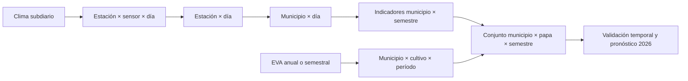

## 3. Clima: comportamiento durante un mes

La siguiente figura toma enero de 2025. Para cada día calcula la mediana entre
los municipios con dato válido en cada departamento. No muestra una estación
particular ni imputa municipios sin dato.

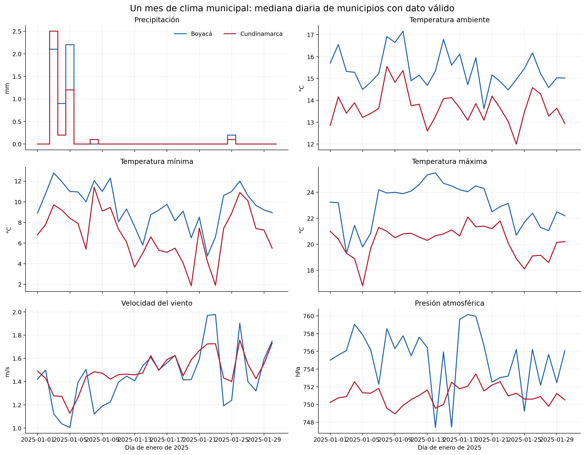

Interpretación:

- la precipitación es intermitente y predominan días con mediana cero;
- las temperaturas ambiente, mínima y máxima conservan unidades y estadísticos
  distintos;
- viento y presión no deben ponerse en el mismo eje que la temperatura;
- las diferencias persistentes entre departamentos reflejan composición
  territorial y red observada, no una corrección aplicada por el pipeline.

Un solo mes sirve para verificar continuidad, saltos y coherencia diaria, pero
no alcanza para describir estacionalidad.

## 4. Clima: comportamiento durante varios meses

La vista 2024–2025 conserva un panel y una escala por variable. La precipitación
mensual suma la mediana diaria regional; las demás variables promedian esas
medianas diarias.


La serie mensual permite:

- observar meses secos y húmedos sin confundir suma con promedio;
- comparar la amplitud de temperatura mínima y máxima;
- identificar cambios persistentes de viento o presión;
- reconocer interrupciones comunes a varias variables.

No representa la climatología completa de cada departamento: resume únicamente
municipios que cuentan con dato municipal válido en la red de estaciones.

## 5. Controles aplicados a las series climáticas

La auditoría aplicó controles distintos en cada etapa.

| Etapa | Pregunta | Decisión |
|---|---|---|
| Descarga | ¿Están las 48 combinaciones de departamento, año y mes? | Conservar partes y manifiestos; no sobrescribir crudo |
| Esquema | ¿Fecha, estación, sensor, unidad y valor son interpretables? | Rechazar filas incompatibles con motivo |
| Llave | ¿Una estación-sensor-fecha tiene un solo valor? | Eliminar duplicado exacto; aislar contradicción |
| Tiempo | ¿Qué cadencia existe dentro del día? | Inferirla por día y medir cobertura |
| Rango | ¿El valor cabe en el contrato físico-operativo? | Marcar o rechazar; no recortar |
| Día | ¿Cómo se resume cada variable? | Suma para precipitación; media, mínimo o máximo según contrato |
| Estación | ¿Hay sensores paralelos coherentes? | Selección trazable; no sumar ni promediar discrepancias |
| Geografía | ¿La estación pertenece realmente al municipio? | Punto-en-polígono y catálogo oficial |
| Municipio | ¿Cuántas estaciones aportaron y cuánto discrepan? | Mediana principal más diagnósticos |

### Contratos individuales

| Variable | Regla diaria | Unidad | Alcance ejecutado |
|---|---|---|---|
| Precipitación | Suma de incrementos válidos | mm | 01–07; revisión científica municipal pendiente |
| Temperatura ambiente | Media diaria | °C | 01–07 completo |
| Temperatura mínima | Mínimo diario | °C | 01–07 completo |
| Temperatura máxima | Máximo diario | °C | 01–07 completo |
| Velocidad del viento | Media diaria | m/s | 01–07 completo |
| Presión atmosférica | Media diaria | hPa | 01–07 completo |
| Humedad | Sin regla aprobada | — | Bloqueada antes de 03 |

Humedad no se procesó por analogía. La falta de contrato confiable fue tratada
como una compuerta, no como una ausencia de código que pudiera ignorarse.

## 6. Principales problemas encontrados

### Brecha transversal de febrero de 2025

Entre el 5 y el 25 de febrero la fuente no ofrece observaciones válidas para el
alcance. La franja roja representa ausencia de observaciones, no clima cero.

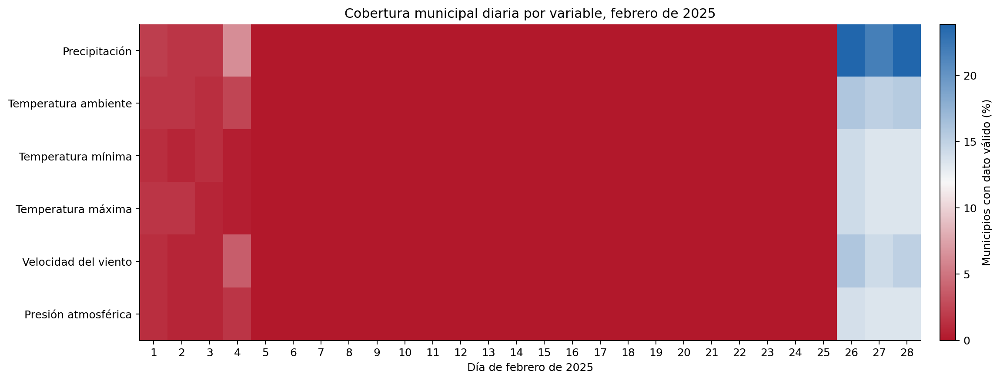

### Otros hallazgos

| Problema | Ejemplo | Tratamiento |
|---|---|---|
| Cadencias mezcladas | Registros cada 1, 2, 5, 10 o 60 minutos | Inferencia dentro de cada día |
| Duplicados exactos | Misma estación, sensor, fecha y valor | Una copia se conserva; el conteo queda auditado |
| Valores contradictorios | Cuatro claves en temperatura máxima | Se excluyen; no se promedian |
| Sensores paralelos | Más de un sensor para estación-día | Se mide diferencia y se selecciona con regla |
| Cambio de escala | Precipitación `3505500121/0240` | Factor 0,1 solo en intervalo probado |
| Patrón instrumental | Precipitación `0035215030/0240` | Cuarentena limitada al intervalo con evidencia |
| Coordenadas variables | 11–12 estaciones según variable | Revisión geográfica; no corrección silenciosa |
| Municipio sin estación | 155 municipios sin estación utilizable en precipitación | `NaN`, nunca cero |
| Cobertura insuficiente | 92 municipio-días en precipitación | Bandera y compuerta científica |

## 7. Agregación climática a escala municipal diaria

### Paso 1: estación × sensor × día

Cada variable aplica su estadístico. Antes se eliminan duplicados exactos, se
excluyen claves contradictorias y se calculan observaciones esperadas según
cadencia. La salida conserva cobertura, rechazados y conflictos.

### Paso 2: estación × día

Si hay sensores paralelos, la consolidación evita contarlos como estaciones
independientes. El producto conserva sensor seleccionado, sensores observados,
diferencia, calidad y motivo de revisión.

### Paso 3: geografía canónica

El código de estación se contrasta con el catálogo oficial y luego con los 239
polígonos DIVIPOLA. Una coincidencia de nombre es solo candidata. Los casos en
revisión no entran al agregado municipal.

### Paso 4: municipio × día

Para cada municipio-fecha se cuenta cuántas estaciones se esperaban, cuántas
tenían fila y cuántas aportaron un valor válido. La mediana de estaciones es el
valor principal; media, extremos, desviación y rango permiten auditarlo.

La capa diaria se mantuvo porque precipitación, extremos térmicos y rachas
dependen del orden de los días. Una agregación temporal anterior al cálculo de
estos indicadores eliminaría esa información.

### Distribución de las estaciones climáticas

El mapa reúne 127 estaciones con asignación municipal canónica en al menos una
de las seis variables procesadas. El tamaño y el color de cada punto indican
cuántas variables aportó la estación. La distribución no es uniforme: varios
municipios carecen de una estación utilizable, mientras que otros concentran
estaciones con cobertura multivariable.

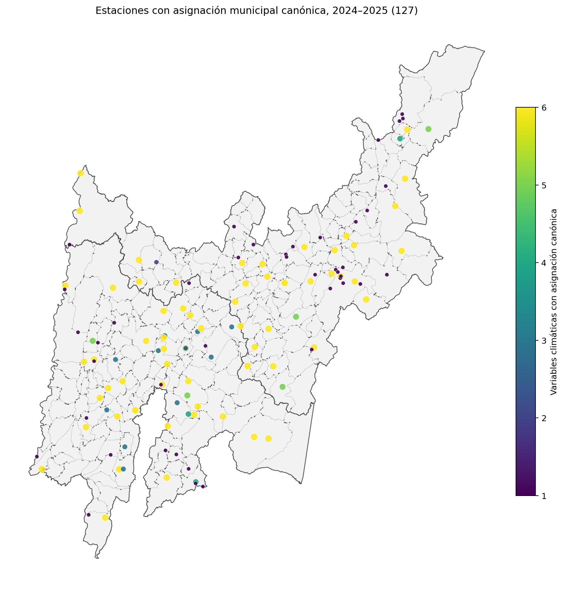

## 8. Frecuencia original de los datos agrícolas

El artefacto municipal Socrata contiene años 2022–2024 y tres tipos de período.
La gráfica muestra filas consolidadas, no hectáreas.

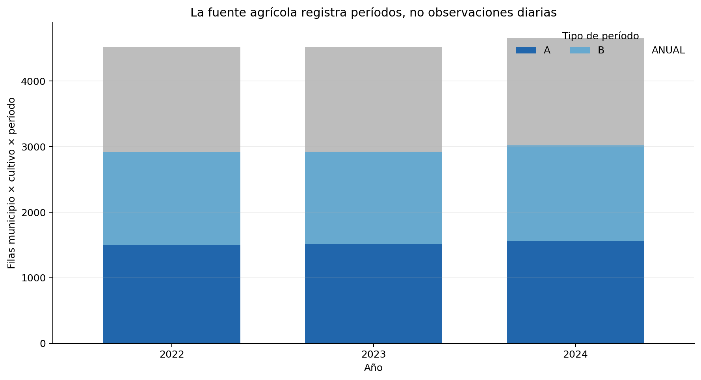

Los períodos significan:

- `A`: primer semestre;
- `B`: segundo semestre;
- `ANUAL`: reporte o cultivo anual.

No se compara A con B ni semestral con anual. Cada comparación interanual
empareja el mismo municipio, cultivo y tipo de período.

## 9. Agregación por municipio, cultivo y período

La fuente puede traer varias filas de un mismo cultivo por ciclo, estado físico
o componente. El agregado:

1. normaliza departamento, municipio, cultivo y período;
2. valida código DANE y compatibilidad ciclo-período;
3. suma áreas y producción compatibles;
4. recalcula rendimiento ponderado como producción total dividida por área
   cosechada total;
5. exporta incompatibilidades, en vez de sumarlas;
6. conserva una llave única
   `codigo_municipio + año + tipo_periodo + cultivo`.

Resultados de `cultivo_municipio_periodo_v1`:

- 14.962 filas de entrada;
- 13.692 filas consolidadas;
- 9.377 comparaciones interanuales;
- 239 municipios enlazados con geometría;
- 43 incidencias ciclo-período fuera del agregado;
- 1.159 llaves con múltiples desagregaciones marcadas para revisión.

Área sembrada, área cosechada y rendimiento conservan universos de validez
independientes. No se descarta un área sembrada válida porque la cosecha sea
cero.

### Distribución municipal de los diez cultivos principales

Los diez cultivos se seleccionaron por área sembrada acumulada entre 2022 y
2024, incluyendo períodos semestrales y anuales. El mapa asigna a cada municipio
el cultivo con mayor área dentro de ese grupo. Esta clasificación representa
predominio por área sembrada; no implica mayor rendimiento ni mayor producción.


| Posición | Cultivo | Área sembrada acumulada (ha) |
|---:|---|---:|
| 1 | Papa | 373.478,17 |
| 2 | Caña | 189.489,60 |
| 3 | Café | 119.874,96 |
| 4 | Maíz | 75.073,81 |
| 5 | Frijol | 44.732,61 |
| 6 | Plátano | 40.666,05 |
| 7 | Cacao | 38.708,90 |
| 8 | Arveja | 31.453,69 |
| 9 | Mango | 30.793,28 |
| 10 | Cebolla de bulbo | 23.171,49 |

## 10. Integración temporal de clima y cultivos

Los datos climáticos se consolidaron a municipio × día. Para unirlos con EVA se
parte el calendario en semestres A y B y se calculan indicadores por municipio:

- precipitación total, promedio diario y máximo de un día;
- días húmedos y mayor racha seca;
- temperatura media, mínima y máxima;
- rango térmico y días cálidos o fríos;
- humedad, viento y presión;
- cobertura y días con todas las variables;
- tres bloques dentro del semestre para conservar parte de la evolución.

El resultado climático usa la misma llave territorial y temporal:

```text
codigo_municipio + anio + tipo_periodo
```

Al agregar `cultivo`, puede unirse uno a uno con la fila agrícola.

## 11. Selección del cultivo

Entre los cultivos semestrales 2022–2024, papa acumuló 373.478 hectáreas
sembradas en 155 municipios. Maíz, segundo en el ranking, acumuló 75.074.

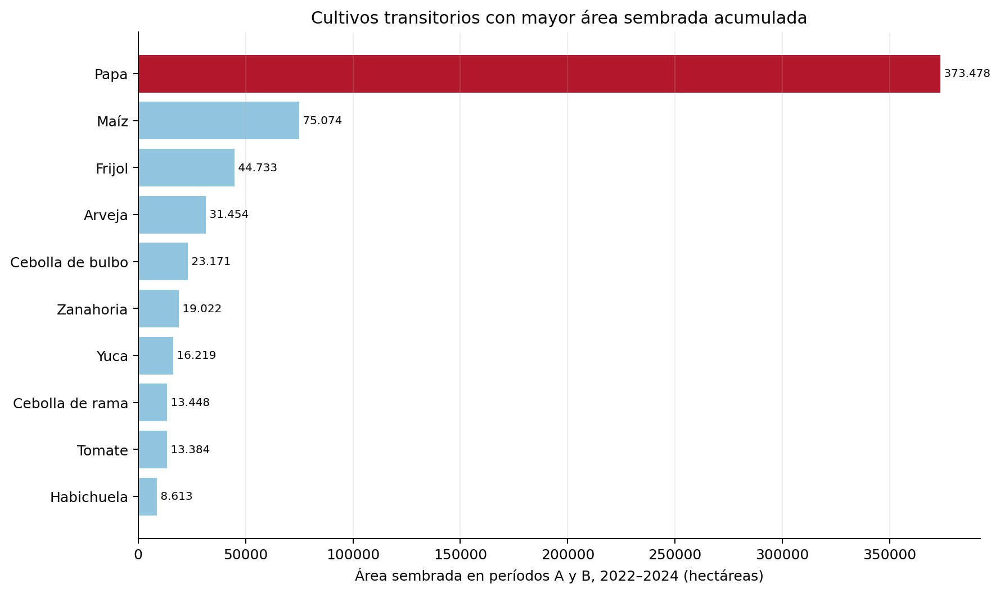

La elección combina importancia territorial y disponibilidad de historia. Para
el pronóstico se usó el Excel oficial UPRA 2019–2025, más amplio que el
artefacto Socrata 2022–2024.

### Agregado municipal de papa

Los siguientes mapas presentan área sembrada, área cosechada, producción y
rendimiento ponderado acumulados para 2022–2024. Las escalas logarítmicas de
área y producción permiten distinguir municipios con valores pequeños sin
ocultar la concentración de los valores mayores.

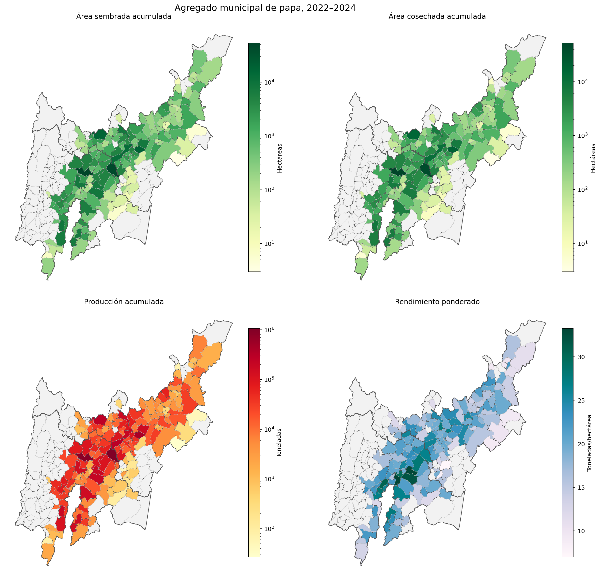

### Producción municipal por año

La comparación anual utiliza la misma escala en 2022, 2023 y 2024. Las etiquetas
identifican los cinco municipios con mayor producción de papa en cada año. La
concentración principal se mantiene alrededor de Tausa, Villapinzón, Siachoque,
Ventaquemada y Saboyá, aunque el orden puede cambiar entre períodos.

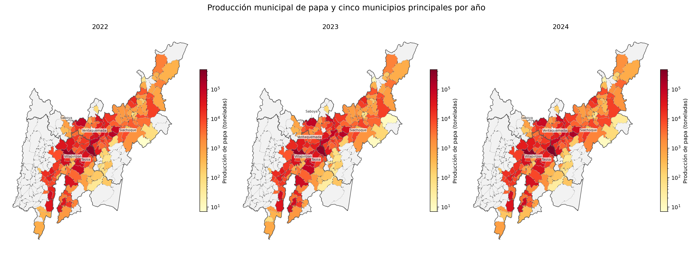

| Posición | 2022 | Producción (t) | 2023 | Producción (t) | 2024 | Producción (t) |
|---:|---|---:|---|---:|---|---:|
| 1 | Villapinzón | 295.757,0 | Villapinzón | 306.905,4 | Villapinzón | 465.060,0 |
| 2 | Tausa | 273.321,0 | Tausa | 268.160,0 | Tausa | 323.180,0 |
| 3 | Siachoque | 122.308,0 | Siachoque | 125.540,0 | Siachoque | 168.760,0 |
| 4 | Ventaquemada | 113.390,0 | Saboyá | 100.170,0 | Ventaquemada | 80.595,0 |
| 5 | Saboyá | 99.210,0 | Ventaquemada | 98.742,0 | Saboyá | 75.100,0 |

## 12. Historia del rendimiento seleccionada

La línea muestra la mediana municipal y la banda el rango entre los percentiles
25 y 75. Los semestres se presentan separados porque pueden responder a
condiciones climáticas y productivas distintas.

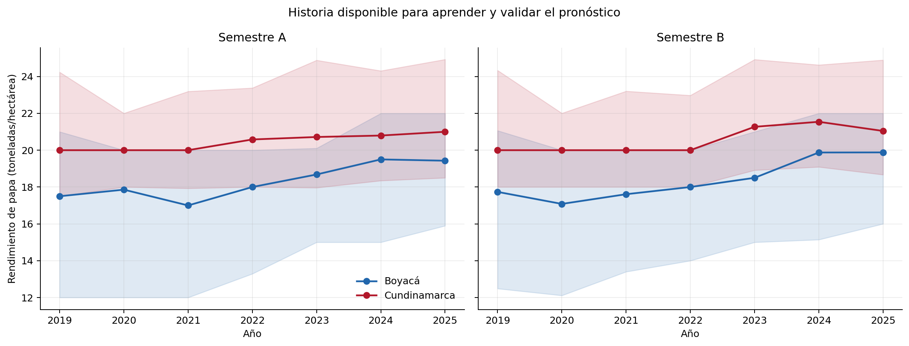

Siete años por municipio y semestre son suficientes para una validación temporal
básica, pero insuficientes para ajustar de manera estable modelos temporales
complejos separados por municipio.

## 13. Conjunto de datos definitivo

El conjunto de datos tiene 2.366 filas y 56 columnas. Su llave es municipio,
año, semestre y cultivo.

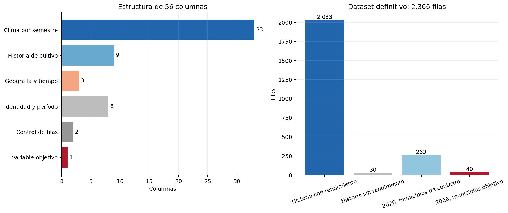

Los predictores candidatos se reparten en:

- 33 indicadores climáticos;
- 9 variables de historia agrícola;
- 3 variables geográficas o temporales;
- categorías de municipio, departamento y semestre según representación.

Producción y área cosechada no entran al modelo porque revelarían directamente
el rendimiento. El área sembrada solo entra rezagada.

### Fuente climática para el pronóstico

El modelo usa NASA POWER 2019–2026, no la capa IDEAM 2024–2025. La razón es de
cobertura: la malla NASA ofrece un valor diario comparable para todos los
municipios y años. La red IDEAM conserva mayor proximidad observacional, pero
deja municipios sin estación y no cubre toda la historia de entrenamiento.

En 2026:

- semestre A: 181 días reales;
- semestre B: 27 días reales y 157 días de climatología 2019–2025.

El segundo semestre es por tanto un escenario condicionado a la fecha de corte.

## 14. Métodos probados y representaciones

Se compararon dos referencias simples, regresión lineal regularizada, bosques de
árboles, árboles extra, potenciación por gradiente y una red neuronal multicapa.

Las categorías binarias crean columnas 0/1 por entidad. La representación
geografía + historia evita una identidad neuronal del municipio y usa
coordenadas, rezagos, departamento y semestre. No se usaron representaciones
vectoriales semánticas porque no existe texto libre.

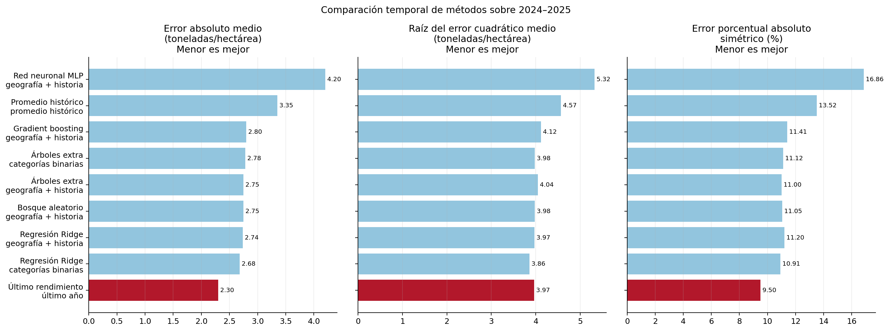

### Definición de las métricas

- **Error absoluto medio:** distancia promedio entre real y pronosticado. Está
  en toneladas por hectárea. Menor es mejor.
- **Raíz del error cuadrático medio:** da mayor castigo a errores grandes.
  También está en toneladas por hectárea. Menor es mejor.
- **Coeficiente de determinación:** mide qué fracción de la variación explica el
  método. Uno es ideal; negativo significa peor que usar un promedio.
- **Error porcentual absoluto simétrico:** expresa un error porcentual balanceado
  entre sobrestimar y subestimar. Menor es mejor.

La selección priorizó el error absoluto medio sobre 2024–2025. El último
rendimiento obtuvo 2,302 t/ha, frente a 2,680 de Ridge con categorías binarias.
Ridge tuvo una raíz del error cuadrático medio algo menor, pero no ganó la
métrica acordada.

## 15. Justificación del modelo seleccionado

ARIMA, Prophet o redes recurrentes pueden ser apropiados con series largas,
regulares y comparables. Aquí cada municipio-semestre aporta como máximo siete
observaciones históricas de rendimiento, existe un cambio metodológico en EVA y
2026B aún contiene climatología.

Los riesgos identificados para un modelo más complejo son:

1. demasiados parámetros para pocos puntos por municipio;
2. sobreajuste a cambios metodológicos o años particulares;
3. falsa precisión al tratar clima futuro climatológico como observado.

La validación año por año mostró que la persistencia local obtuvo el menor error
fuera de muestra. Este resultado determinó la selección del modelo.

## 16. Alcance del pronóstico

El alcance son los semestres 2026A y 2026B para diez municipios de cada
departamento. Los puntos son pronósticos y las líneas representan el percentil
90 del error absoluto observado en la validación retrospectiva. No son intervalos
probabilísticos calibrados.


El mapa localiza los 20 municipios objetivo y utiliza una escala común para
comparar los rendimientos pronosticados entre departamentos y semestres. Los
municipios sin color no pertenecen al conjunto objetivo del pronóstico.


| Departamento | Semestre | Media | Mediana | Mínimo | Máximo |
|---|---|---:|---:|---:|---:|
| Boyacá | A | 22,58 | 20,21 | 18,45 | 35,00 |
| Boyacá | B | 24,27 | 21,91 | 18,79 | 39,85 |
| Cundinamarca | A | 26,43 | 24,73 | 19,82 | 35,00 |
| Cundinamarca | B | 25,58 | 24,86 | 17,00 | 32,79 |

En la validación retrospectiva global 2021–2025 hubo 200 observaciones. El error
absoluto medio fue 2,422 t/ha, la raíz del error cuadrático medio 3,991 t/ha, el
coeficiente de determinación 0,276 y el error porcentual absoluto simétrico
10,12 %.

El segmento más débil fue Cundinamarca-B: error absoluto medio 3,261 t/ha y
coeficiente de determinación −0,221. Esa limitación debe acompañar siempre la
presentación del promedio global.

## 17. Estado de ejecución y tareas pendientes

Concluido:

- seis variables IDEAM hasta municipio-día;
- agregado agrícola municipio × cultivo × período;
- cruce geográfico por código DANE;
- conjunto de datos de papa 2019–2026;
- comparación temporal de nueve candidatos;
- 40 pronósticos para 2026.

Abierto:

- contrato diario de humedad IDEAM;
- aprobación científica de cobertura municipal de precipitación;
- indicadores de período desde la capa IDEAM;
- sustitución progresiva de climatología 2026B por días reales;
- validación del pronóstico cuando EVA publique el rendimiento observado de
  2026.

## 18. Reproducibilidad

Las figuras se regeneran con:

```bash
MPLCONFIGDIR=/tmp/suelosabio-matplotlib \
python docs/presentation/generate_presentation_charts.py
```

En otra máquina se puede definir `ECO2026_PROCESSED_ROOT` con la ruta de
`eco2026_processed` y `ECO2026_SHARED_ROOT` con la carpeta que contiene el
GeoPackage municipal. El script solo lee artefactos y escribe PNG dentro de
`docs/presentation/assets/`.
